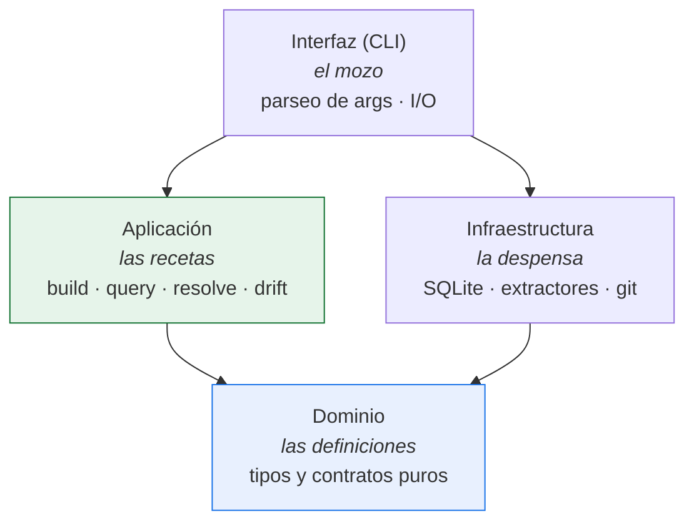
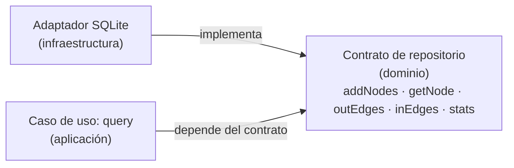
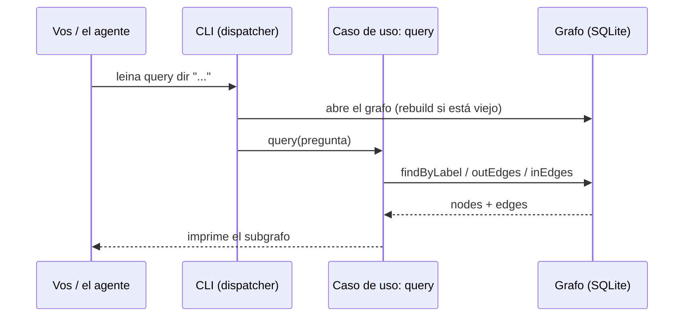
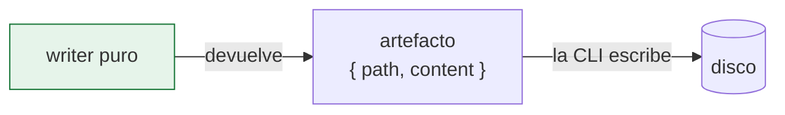

# 1. Arquitectura general

> **En una frase:** leina es una CLI con arquitectura **hexagonal** (puertos y
> adaptadores), donde la lógica de negocio no depende de SQLite ni del sistema de
> archivos — y donde cada comando corre y termina, *sin un daemon siempre encendido*.

---

## La cocina del restaurante

Pensá leina como un restaurante:

- El **mozo** toma tu pedido (`leina query ...`), lo lleva a la cocina y te
  trae el plato. No cocina; solo traduce entre vos y la cocina.
- Las **recetas** describen *cómo* preparar cada plato paso a paso, sin
  importar qué marca de horno o heladera tengas.
- La **despensa y los electrodomésticos** son las cosas concretas: la
  heladera (SQLite), el horno (los extractores de código), la balanza (git).
- Las **definiciones de qué es cada plato** — qué lleva una "pizza", qué es un
  "node" o un "edge" — son contratos puros: ningún electrodoméstico, ninguna marca.

La regla de oro de la cocina: **las recetas y las definiciones nunca mencionan marcas**. Si
mañana cambiás la heladera, las recetas no cambian. Eso es la **regla de dependencias** de la
arquitectura hexagonal.

---

## Las cuatro capas

Las flechas son **dependencias permitidas**. Fijate que todas apuntan hacia el **dominio**, y que
la **aplicación** **nunca** apunta a la **infraestructura**: las recetas no conocen marcas.

| Capa | Responsabilidad |
|------|-----------------|
| **Dominio** | Tipos y contratos puros. Cero I/O, cero dependencias externas. Define qué es un `node`, un `edge`, una `observation`. |
| **Aplicación** | Casos de uso y algoritmos: build, query, resolve, drift. Depende solo del dominio. |
| **Infraestructura** | Adaptadores concretos que *implementan* los contratos: SQLite, los extractores de código, git. |
| **Interfaz (CLI)** | Composición + I/O. El único lugar que *construye* infraestructura. |

---

## Puertos y adaptadores en concreto

El contrato vive en el **dominio**; la implementación, en la **infraestructura**. La capa de
**aplicación** recibe el contrato y nunca sabe quién lo cumple.

Hay un **único lugar de composición** que construye los adaptadores concretos y se los inyecta a
los casos de uso. Estos reciben siempre el contrato, nunca la implementación concreta. Cambiar de
motor de almacenamiento no toca ni una línea de la lógica de negocio.

---

## El recorrido de un comando

Cuando ejecutás `leina query <dir> "quién usa TokenFactory"`, esto es lo que pasa:

La CLI enruta cada comando al caso de uso correcto; toda la lógica vive más adentro.

---

## Dos decisiones de diseño que conviene entender

### CLI-first (sin daemon siempre encendido)

La capacidad de todos los días es un `leina <subcomando>` que arranca, responde y termina.
Los dos servidores que existen son opt-in y los corés a demanda: `leina mcp` (el servidor MCP
por stdio que tu host de IA lanza para llamar a las herramientas) y `leina graph serve` (un
explorador HTTP de solo lectura en foreground, ligado a loopback). ¿Por qué este modelo?

- **Arranque rápido (~0.15s) en el camino de lectura.** El stack pesado de extracción de código
  se carga solo al construir o refrescar el grafo. Una `query` o un `memory search` nunca pagan
  ese costo.
- **Sin estado entre invocaciones.** No hay un daemon siempre encendido que se desincronice;
  cada comando lee el estado fresco del disco.

### Writers puros

Todo lo que *escribe archivos* en la superficie de install (skills, agents, hooks, protocolo)
se modela como **funciones puras** que devuelven un artefacto `{ path, content }`. El writer
**no toca el disco**; la CLI hace todo el I/O.

Dos consecuencias prácticas:

1. **Idempotencia.** Re-correr un writer sobre su propia salida devuelve exactamente lo mismo.
2. **Testeable sin filesystem.** Probás el `content` que produce sin montar directorios.

---

## Para seguir

- Cómo el cartógrafo levanta el mapa → [El grafo de código](./02-grafo.md)
- Cómo se consulta ese mapa → [Búsqueda y consultas](./03-busqueda-y-consultas.md)
