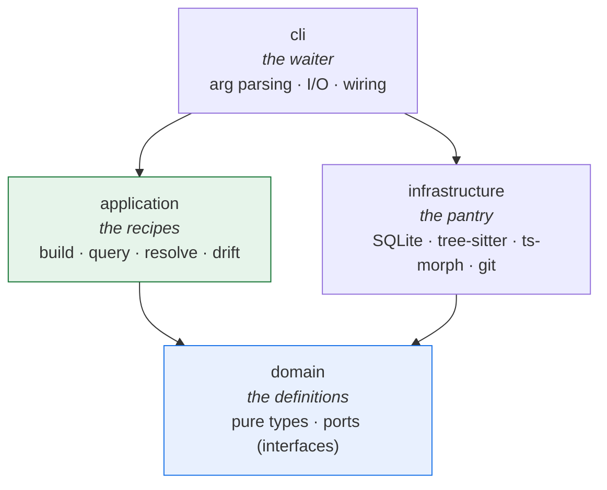
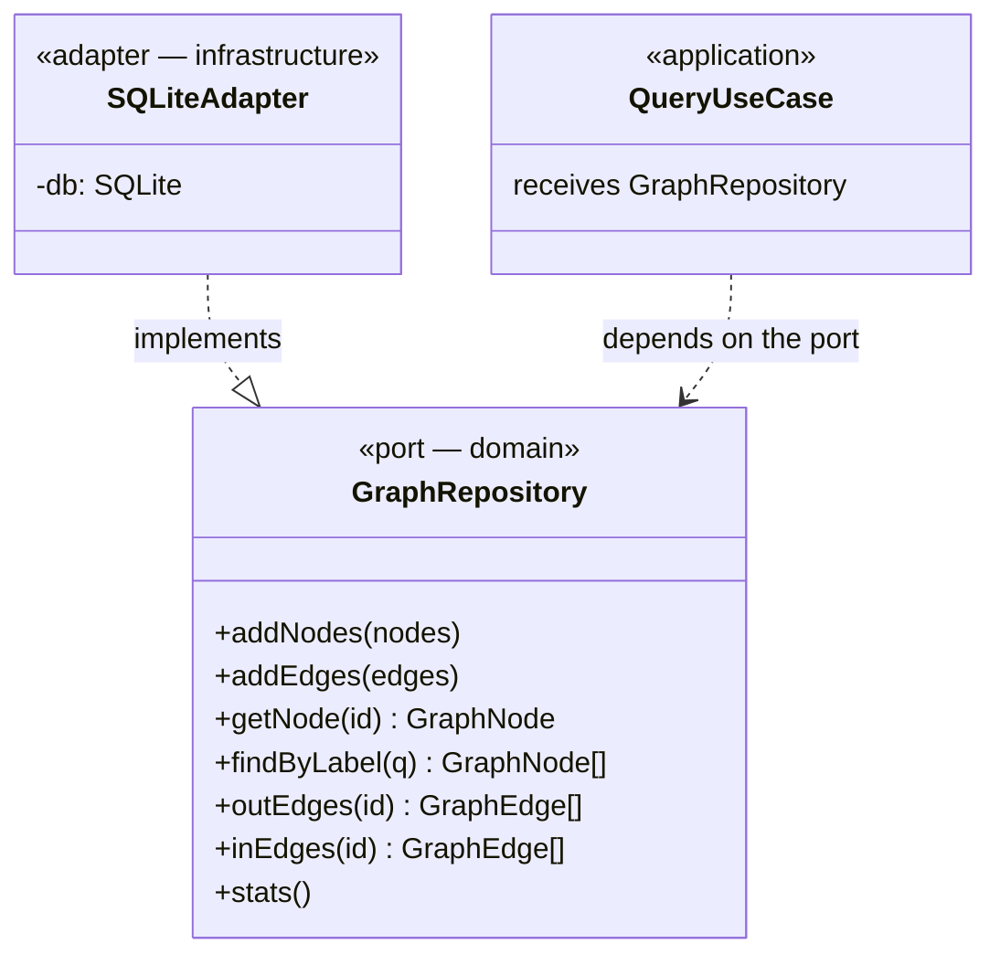
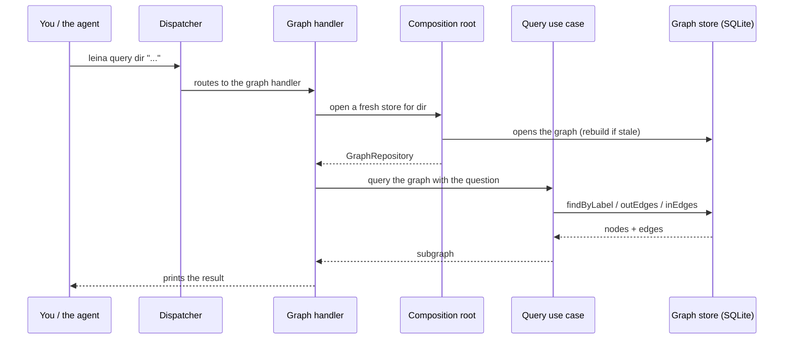
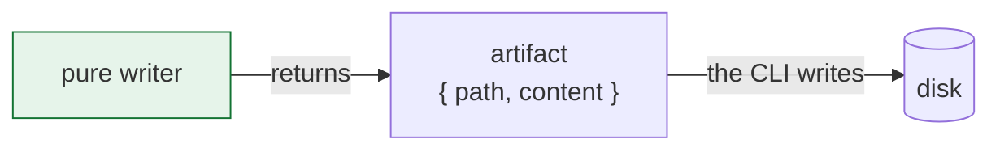

# 1. General architecture

> **In one sentence:** leina is a CLI with a **hexagonal** architecture (ports and
> adapters) in four layers, where the business logic knows nothing about SQLite or the
> file system — and where every command runs and exits, *with no always-on daemon*.

---

## The restaurant kitchen

Think of leina as a restaurant:

- The **waiter** (the CLI layer) takes your order (`leina query ...`), carries it to the
  kitchen, and brings you the dish. It doesn't cook; it only translates between you and
  the kitchen.
- The **recipes** (the application layer) describe *how* to prepare each dish step by step, no
  matter what brand of oven or fridge you have.
- The **pantry and appliances** (the infrastructure layer) are the concrete things: the fridge
  (SQLite), the oven (tree-sitter, ts-morph), the scale (git).
- The **definitions of what each dish is** (the domain layer) — what goes into a "pizza," what a
  "node" or an "edge" is — are pure contracts: no appliances, no brands.

The golden rule of the kitchen: **the recipes and the definitions never mention brands**.
If you swap the fridge tomorrow, the recipes don't change. That's the **dependency rule**
of hexagonal architecture.

---

## The four layers

The arrows are **allowed dependencies**. Notice that they all point toward the domain, and
that the application layer **never** points to infrastructure: the recipes don't know about
brands.

| Layer | Responsibility |
|------|-----------------|
| **Domain** | Pure types and contracts (`GraphNode`, `GraphEdge`, the memory model, and the ports they flow through). Zero I/O, zero external dependencies. |
| **Application** | Use cases and algorithms: build, query, resolve, drift detection, project-key detection. Depends only on the domain. |
| **Infrastructure** | Concrete adapters that *implement* the ports: the SQLite stores, the tree-sitter and ts-morph extractors, git. |
| **CLI** | Composition and I/O. The only place that *builds* infrastructure: it dispatches commands and wires everything together. |

---

## Ports and adapters, concretely

The contract lives in the domain; the implementation, in infrastructure. The
application layer receives the contract and never knows who fulfills it.

A single **composition root** is the *only* place where concrete stores are constructed.
Handlers receive the port, never the concrete class — so the read and write logic never
depends on SQLite.

---

## The journey of a command

When you run `leina query <dir> "who uses TokenFactory"`, here's what happens:

The dispatcher is a **pure router**: it reads the subcommand and routes to the correct
handler. All the logic lives further in.

---

## Two design decisions worth understanding

### CLI-first (no always-on daemon)

The everyday capability is a `leina <subcommand>` that starts up, responds, and exits. The
two servers that exist are opt-in and run on demand: `leina mcp` (the stdio MCP server your
AI host launches to call leina's tools) and `leina graph serve` (an optional read-only HTTP
explorer bound to loopback). Why this model?

- **Fast startup (~0.15s) on the read path.** The heavy code-extraction stack is loaded only
  in `build`/`refresh`. A `query` or a `memory search` never pays that cost.
- **No state between invocations.** There's no always-on daemon that can drift out of sync;
  every command reads fresh state from disk.

### Pure writers

Everything that *writes files* on the install surface (skills, agents, hooks, protocol)
is modeled as **pure functions** that return an artifact `{ path, content }`. The writer
**never touches disk**; the CLI does all the I/O.

Two practical consequences:

1. **Idempotence.** Re-running a writer over its own output returns exactly the same
   thing.
2. **Testable without a filesystem.** You test the `content` it produces without mounting
   directories.

---

## Up next

- How the cartographer builds the map → [The code graph](./02-grafo.md)
- How that map is queried → [Search and queries](./03-busqueda-y-consultas.md)
