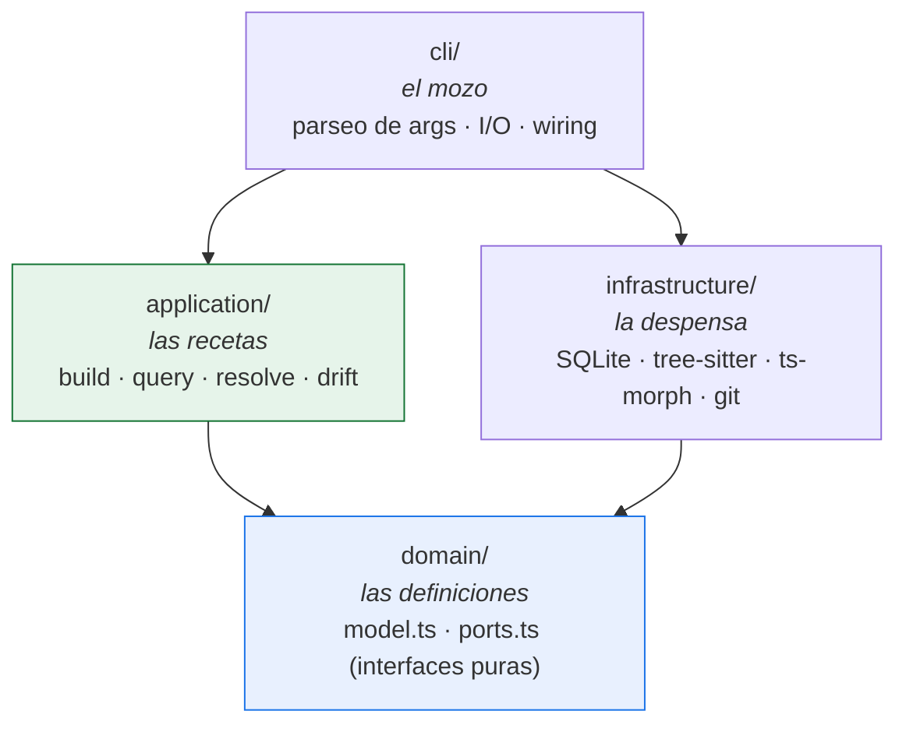
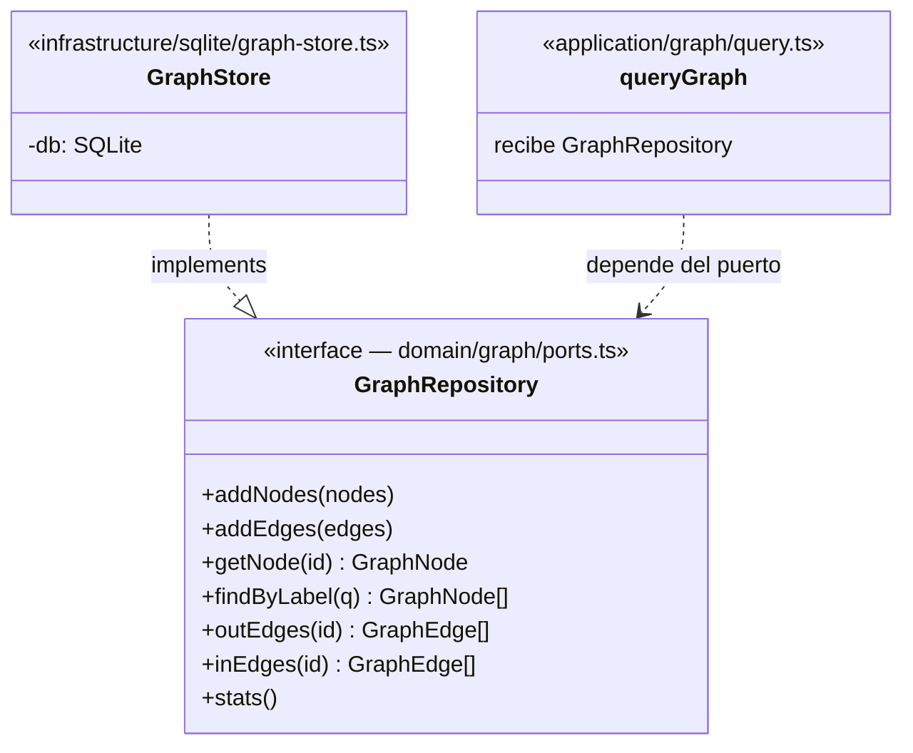
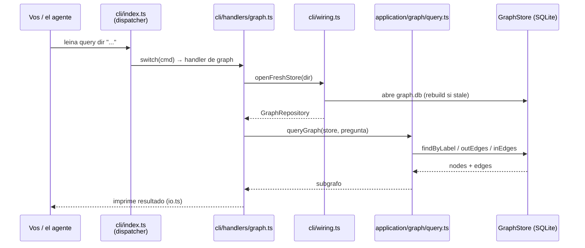
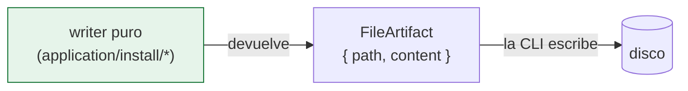

# 1. Arquitectura general

> **En una frase:** leina es una CLI con arquitectura **hexagonal** (puertos y
> adaptadores) en cuatro capas, donde la lógica de negocio no sabe nada de SQLite ni del
> sistema de archivos — y donde *no hay servidor*.

---

## La cocina del restaurante

Pensá leina como un restaurante:

- El **mozo** (`cli/`) toma tu pedido (`leina query ...`), lo lleva a la cocina y te
  trae el plato. No cocina; solo traduce entre vos y la cocina.
- Las **recetas** (`application/`) describen *cómo* preparar cada plato paso a paso, sin
  importar qué marca de horno o heladera tengas.
- La **despensa y los electrodomésticos** (`infrastructure/`) son las cosas concretas: la
  heladera (SQLite), el horno (tree-sitter, ts-morph), la balanza (git).
- Las **definiciones de qué es cada plato** (`domain/`) — qué lleva una "pizza", qué es un
  "node" o un "edge" — son contratos puros: ningún electrodoméstico, ninguna marca.

La regla de oro de la cocina: **las recetas y las definiciones nunca mencionan marcas**. Si
mañana cambiás la heladera, las recetas no cambian. Eso es la **regla de dependencias** de la
arquitectura hexagonal.

---

## Las cuatro capas

Las flechas son **dependencias permitidas**. Fijate que todas apuntan hacia `domain/`, y que
`application/` **nunca** apunta a `infrastructure/`: las recetas no conocen marcas.

| Capa | Carpeta | Responsabilidad | Ejemplos |
|------|---------|-----------------|----------|
| **Domain** | `src/domain/` | Tipos y contratos puros. Cero I/O, cero dependencias externas. | `graph/model.ts` (`GraphNode`, `GraphEdge`), `graph/ports.ts` (`GraphRepository`), `memory/model.ts`, `memory/ports.ts` |
| **Application** | `src/application/` | Casos de uso / algoritmos. Depende solo de `domain`. | `graph/build.ts`, `graph/query.ts`, `graph/resolve.ts`, `memory/query.ts` (drift), `project/detect-key.ts` |
| **Infrastructure** | `src/infrastructure/` | Adaptadores concretos que *implementan* los ports. | `sqlite/graph-store.ts`, `sqlite/memory-repository.ts`, `extractors/treesitter.ts`, `extractors/semantic/tsmorph.ts` |
| **CLI** | `src/cli/` | Composición + I/O. El único lugar que *construye* infraestructura. | `index.ts` (dispatcher), `wiring.ts` (composition root), `handlers/*`, `io.ts` |

---

## Puertos y adaptadores en concreto

El contrato vive en `domain`; la implementación, en `infrastructure`. La capa `application`
recibe el contrato y nunca sabe quién lo cumple.

El **composition root** es <ref_file file="src/cli/wiring.ts" />: es el *único* lugar donde se hace
`new GraphStore(...)` o `new SQLiteMemoryRepository(...)`. Los handlers reciben el port, nunca
la clase concreta. <ref_snippet file="src/cli/wiring.ts" lines="26-30" />

---

## El recorrido de un comando

Cuando ejecutás `leina query <dir> "quién usa TokenFactory"`, esto es lo que pasa:

`index.ts` es un **dispatcher puro**: un `switch (cmd)` sobre `process.argv` que rutea al
handler correcto. Toda la lógica vive más adentro.

---

## Dos decisiones de diseño que conviene entender

### CLI-only (no hay servidor)

Toda capacidad es un `leina <subcomando>` que arranca, responde y muere. ¿Por qué?

- **Arranque rápido (~0.15s) en el camino de lectura.** El stack pesado de extracción
  (tree-sitter + ts-morph) se carga con `import()` *dinámico*, solo en `build`/`refresh`. Una
  `query` o un `memory search` nunca pagan ese costo. Por eso `wiring.ts` aclara que el
  `import()` del extractor "stays in the command handlers".
- **Sin estado entre invocaciones.** No hay daemon que se desincronice; cada comando lee el
  estado fresco del disco.

### Writers puros (`FileArtifact`)

Todo lo que *escribe archivos* en la superficie de install (skills, agents, hooks, protocolo)
se modela como **funciones puras** que devuelven `FileArtifact { path, content }` — definido en
`src/domain/install/artifact.ts`. El writer **no toca el disco**; la CLI hace todo el I/O.

Dos consecuencias prácticas:

1. **Idempotencia.** Re-correr un writer sobre su propia salida devuelve exactamente lo mismo.
2. **Testeable sin filesystem.** Probás el `content` que produce sin montar directorios.

---

## Para seguir

- Cómo el cartógrafo levanta el mapa → [El grafo de código](./02-grafo.md)
- Cómo se consulta ese mapa → [Búsqueda y consultas](./03-busqueda-y-consultas.md)
