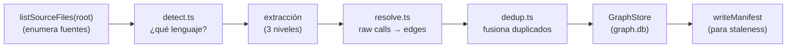
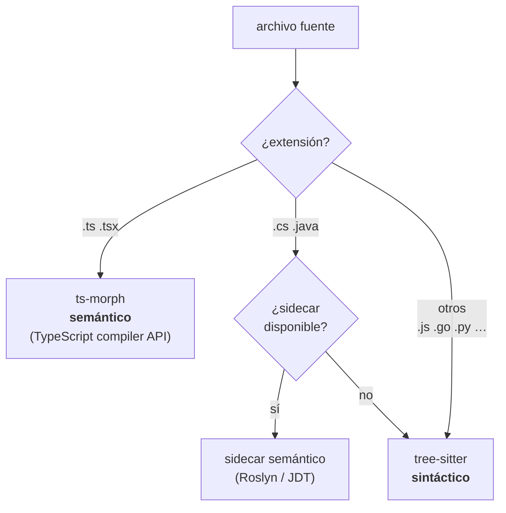
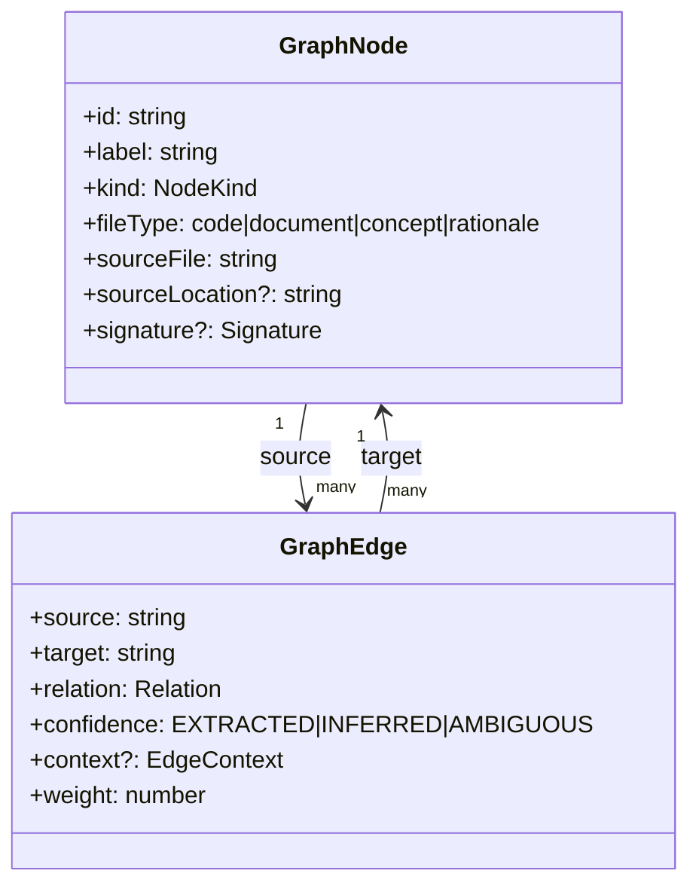
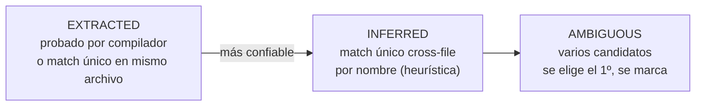
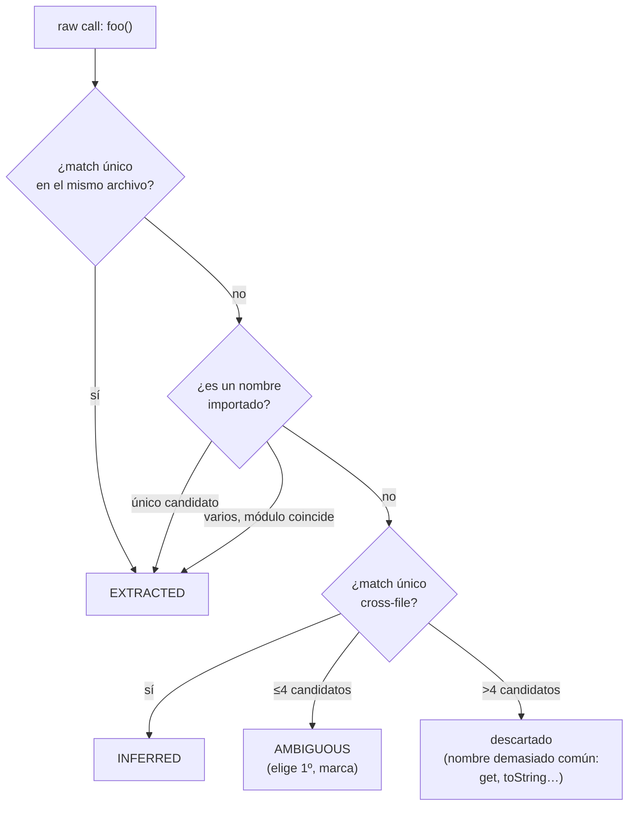

# 2. El grafo de código

> **En una frase:** el grafo convierte tu código (texto plano) en un *mapa de la ciudad* donde
> cada clase, función o método es una esquina (`node`) y cada llamada, herencia o import es una
> calle (`edge`).

---

## De texto plano a mapa de ciudad

Un repositorio es, para una máquina, una pila de strings. Buscar "quién usa `TokenFactory`"
con `grep` es como buscar una dirección leyendo todas las calles de la ciudad una por una.

El **cartógrafo** hace otra cosa: recorre el código una vez, dibuja un mapa, y desde entonces
responde "¿quién llega a esta esquina?" mirando el mapa, no las calles. Ese mapa es el grafo, y
vive en `<proyecto>/.leina/graph.db` (SQLite, uno por repo, git-ignored).

Construirlo es el comando `leina build` (o `refresh`). El punto de entrada es
`buildGraph(root, store)` en <ref_file file="src/application/graph/build.ts" />.

---

## El pipeline de construcción



Tras volcar nodes y edges en SQLite, `build` escribe un **manifest** (huellas de los archivos
fuente) que después sirve para detectar si el mapa quedó viejo — ver
[Búsqueda y consultas](./03-busqueda-y-consultas.md#el-freshness-gate).

---

## Extracción en tres niveles

No todos los lenguajes se leen igual. leina usa una estrategia escalonada que equilibra
**precisión** (grado de compilador) con **portabilidad** (sin dependencias nativas):



| Nivel | Lenguajes | Herramienta | Qué garantiza |
|-------|-----------|-------------|---------------|
| **Semántico (compiler-grade)** | TypeScript / TSX | **ts-morph** (TS compiler API) — `extractTsProject` en `extractors/semantic/tsmorph.ts` | Resolución exacta de símbolos: edges con confianza `EXTRACTED` |
| **Semántico (sidecar)** | C# / Java | proceso externo (Roslyn para C#, JDT para Java) — `runSemanticSidecarProject` en `extractors/semantic/sidecar.ts` | Igual de exacto; si no hay sidecar, **cae** a tree-sitter |
| **Sintáctico** | todo lo demás (JS, Go, Python, …) | **tree-sitter** — `extractFile` en `extractors/treesitter.ts` | AST sin resolución; emite *raw calls* que se resuelven después |

### El sidecar de C#/Java

El cartógrafo no habla C# ni Java nativamente, así que para esos terceriza a un *sidecar*: un
proceso externo que recibe un directorio y devuelve `{ nodes, edges }` como JSON por stdout.
Se configura por variables de entorno:

```bash
LEINA_CSHARP_SIDECAR="dotnet /path/RoslynGraph.dll"
LEINA_JAVA_SIDECAR="java -jar /path/jdt-graph.jar"
```

Si no hay ninguno configurado, podés optar por que se construya on-demand
(`LEINA_BUILD_SIDECARS=1`): se materializan plantillas desde `assets/sidecars/{lang}/`,
se compila con el toolchain local (dotnet SDK / JDK 17+) y el binario queda cacheado en
`~/.leina/sidecars/{lang}/dist/`. Sin sidecar, C#/Java se extraen igual con tree-sitter
(menos preciso, pero funciona).

### El truco de las dos pasadas (TypeScript)

`extractTsProject` recorre el proyecto **dos veces**:

1. **Pasada 1** (`registerSourceFileDefs`): anota *todas* las declaraciones (funciones, clases,
   métodos) en un mapa `declToId`. Arma la "guía telefónica".
2. **Pasada 2** (`linkHeritageAndCalls`): ahora que la guía está completa, resuelve cada
   llamada/herencia al nodo exacto.

¿Por qué dos? Porque TypeScript permite *forward references* y llamadas cruzadas entre
archivos: no podés resolver una llamada a algo que todavía no registraste.

---

## El modelo: nodes y edges

Definido en <ref_file file="src/domain/graph/model.ts" />.



### El `node` (la esquina)

- `id` — identificador **estable y file-scoped**, generado por `makeId(...)` en
  `domain/shared/id.ts`. Normaliza cada parte (NFKC + casefold + colapsa no-alfanuméricos) y une
  con `:`. Ejemplo: `makeId("src/auth.ts", "TokenFactory", "create")` →
  `src_auth_ts:tokenfactory:create`.
- `kind` — `class` · `function` · `method` · `interface` · `module` · `concept`.
- `signature` — solo para funciones/métodos: tipo de retorno, parámetros (con tipo,
  nullabilidad, opcionalidad), modificador de acceso, flags `isAsync`/`isGenerator`.

### El `edge` (la calle)

Cada edge tiene una **relación** (el tipo de calle) y una **confianza** (cuán seguros estamos
de que la calle existe):

| Grupo | `relation` | Significa |
|-------|-----------|-----------|
| Estructural | `contains` | módulo → definición que vive en él |
| Estructural | `method` | clase → su método |
| Llamadas | `calls` | función → función que invoca |
| Llamadas | `references` | función → tipo que usa |
| Imports | `imports`, `imports_from` | dependencia de módulo |
| Herencia | `extends`, `implements`, `inherits` | jerarquía de tipos |
| Otros | `uses` | uso genérico |

**Confianza** (`confidence`) — clave para entender la búsqueda después:



---

## Resolución: de *raw calls* a *edges*

tree-sitter no resuelve símbolos: cuando ve `factory.make()`, solo sabe que hay una llamada a
algo llamado `make`. Eso es un **raw call**. Convertirlos en edges reales es trabajo de
`resolve()` en <ref_file file="src/application/graph/resolve.ts" />, en dos fases:

1. **Retarget de herencia** — los edges `extends`/`implements`/`inherits` apuntan al principio
   a IDs placeholder por etiqueta; se reapuntan al nodo real buscando el label en el índice
   (solo tipos: clases/interfaces, ignorando homónimos de métodos como constructores Java).
2. **Resolución de raw calls** — para cada llamada se buscan candidatos por label normalizado y
   se aplican heurísticas **en orden**:



**Desambiguación por tipo de receptor:** si tree-sitter pudo rastrear que `factory` es de tipo
`TokenFactory`, entonces `factory.make()` se resuelve directo a `TokenFactory.make()` sin
adivinar.

---

## Deduplicación

Antes de volcar a SQLite, `dedup()` (<ref_file file="src/application/graph/dedup.ts" />) limpia:

- **Nodes** — por `id` (last-write-wins).
- **Edges** — por la tupla `(source, target, relation, context)`. Si hay multi-edges, se
  conserva el de **mayor confianza** (`EXTRACTED` 3 > `INFERRED` 2 > `AMBIGUOUS` 1) y se
  acumula `weight`. Los self-loops (`source === target`) se descartan.

---

## Cómo se guarda (el `graph.db`)

`GraphStore` (<ref_file file="src/infrastructure/sqlite/graph-store.ts" />) implementa el port `GraphRepository`. El schema:

```sql
CREATE TABLE nodes (
  id TEXT PRIMARY KEY,
  label TEXT NOT NULL,
  file_type TEXT NOT NULL,
  kind TEXT,
  source_file TEXT NOT NULL,
  source_location TEXT,
  community INTEGER,
  signature TEXT                -- Signature serializada como JSON
);

CREATE TABLE edges (
  source TEXT NOT NULL,
  target TEXT NOT NULL,
  relation TEXT NOT NULL,
  confidence TEXT NOT NULL,
  context TEXT NOT NULL DEFAULT '',
  source_file TEXT NOT NULL,
  source_location TEXT,
  weight REAL NOT NULL DEFAULT 1.0,
  PRIMARY KEY (source, target, relation, context)
);

CREATE INDEX idx_edges_source ON edges(source);   -- vecinos salientes rápidos
CREATE INDEX idx_edges_target ON edges(target);   -- vecinos entrantes rápidos
CREATE INDEX idx_nodes_label  ON nodes(label);    -- lookup por nombre
```

Decisiones a notar:

- **PK compuesta en `edges`** — `(source, target, relation, context)`: los multi-edges se
  fusionan acumulando `weight` (upsert con `ON CONFLICT`).
- **Índices en `source`/`target`** — son los que hacen baratos los recorridos del grafo
  (`outEdges`/`inEdges`), de los que depende toda la búsqueda del próximo capítulo.
- **`signature` como JSON** — se guarda como texto y se parsea al leer.

El schema se versiona con `PRAGMA user_version` (versión 2; v1→v2 agregó la columna
`signature`).

---

## Para seguir

- Ahora que el mapa existe, ¿cómo se consulta? → [Búsqueda y consultas](./03-busqueda-y-consultas.md)
- ¿Cómo se conecta este mapa con las notas del bibliotecario? → [Comunicación grafo–memoria](./05-comunicacion-grafo-memoria.md)
