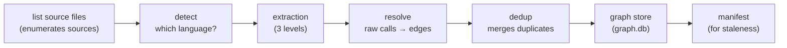
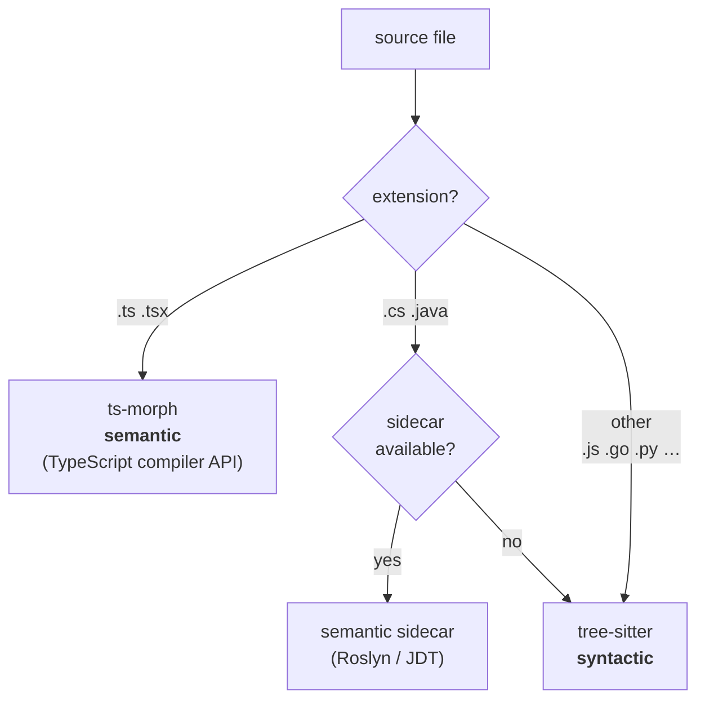
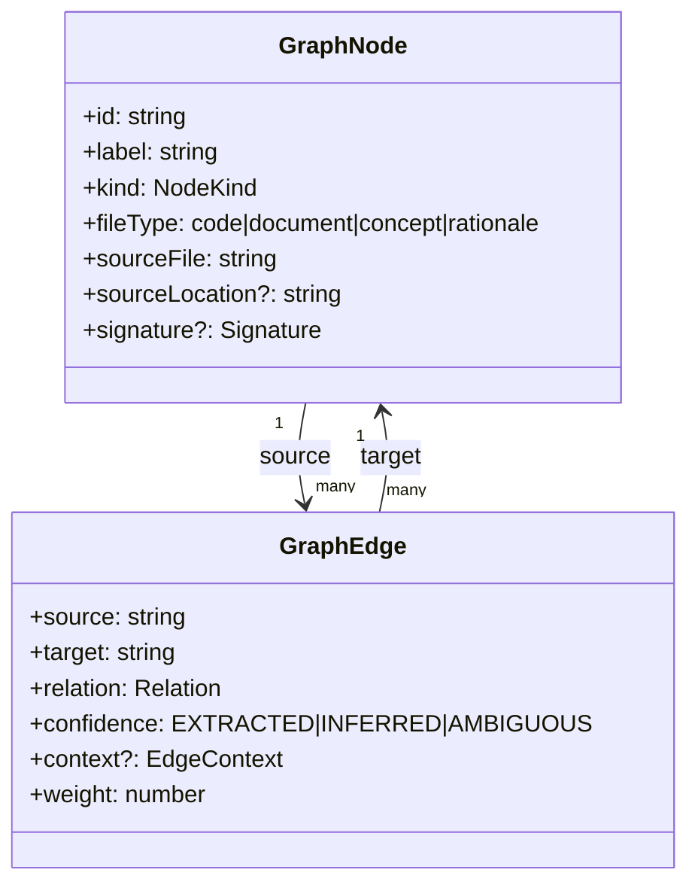
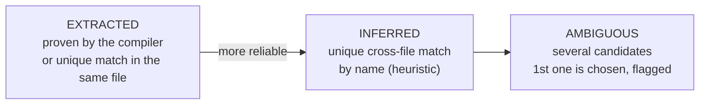
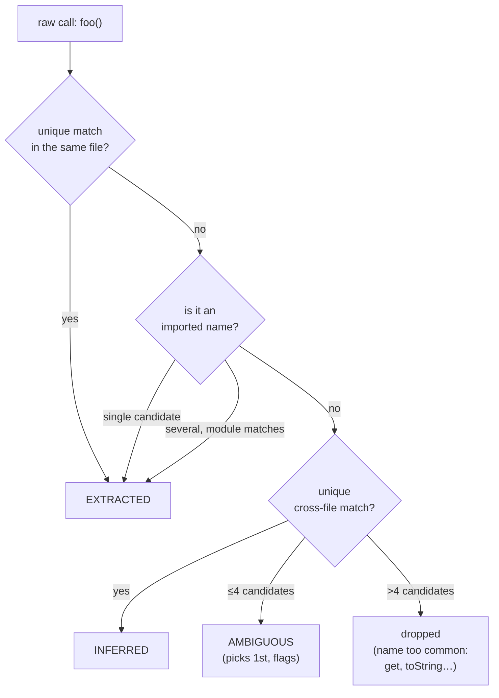

# 2. The code graph

> **In one sentence:** the graph turns your code (plain text) into a *city map* where
> every class, function, or method is an intersection (`node`) and every call, inheritance, or
> import is a street (`edge`).

---

## From plain text to city map

A repository is, to a machine, just a pile of strings. Looking for "who uses `TokenFactory`"
with `grep` is like finding an address by reading every street in the city one by one.

The **cartographer** does something different: it walks through the code once, draws a map,
and from then on answers "who reaches this intersection?" by looking at the map, not the
streets. That map is the graph, and it lives in `<project>/.leina/graph.db` (SQLite, one per
repo, git-ignored).

Building it is the `leina build` command (or `refresh`).

---

## The build pipeline



After dumping nodes and edges into SQLite, `build` writes a **manifest** (fingerprints of the
source files) that's later used to detect if the map has gone stale — see
[Search and queries](./03-busqueda-y-consultas.md#el-freshness-gate).

---

## Three-level extraction

Not every language is read the same way. leina uses a tiered strategy that balances
**precision** (compiler-grade) with **portability** (no native dependencies):



| Level | Languages | Tool | What it guarantees |
|-------|-----------|-------------|---------------|
| **Semantic (compiler-grade)** | TypeScript / TSX | **ts-morph** (TS compiler API) | Exact symbol resolution: edges with `EXTRACTED` confidence |
| **Semantic (sidecar)** | C# / Java | external process (Roslyn for C#, JDT for Java) | Just as exact; if there's no sidecar, it **falls back** to tree-sitter |
| **Syntactic** | everything else (JS, Go, Python, …) | **tree-sitter** | AST without resolution; emits *raw calls* that get resolved later |

### The C#/Java sidecar

The cartographer doesn't speak C# or Java natively, so for those it outsources to a *sidecar*:
an external process that receives a directory and returns `{ nodes, edges }` as JSON over
stdout. It's configured via environment variables:

```bash
LEINA_CSHARP_SIDECAR="dotnet /path/RoslynGraph.dll"
LEINA_JAVA_SIDECAR="java -jar /path/jdt-graph.jar"
```

If none is configured, you can opt to have it built on-demand
(`LEINA_BUILD_SIDECARS=1`): templates are compiled with the local toolchain (dotnet SDK /
JDK 17+), and the resulting binary is cached under `~/.leina/sidecars/`. Without a sidecar,
C#/Java are still extracted with tree-sitter (less precise, but it works).

### The two-pass trick (TypeScript)

For TypeScript, the cartographer walks the project **twice**:

1. **Pass 1** records *all* declarations (functions, classes, methods) in a lookup map. It
   builds the "phone book."
2. **Pass 2** now that the phone book is complete, it resolves each call/inheritance to the
   exact node.

Why two passes? Because TypeScript allows *forward references* and cross-file calls: you can't
resolve a call to something you haven't registered yet.

---

## The model: nodes and edges



### The `node` (the intersection)

- `id` — a **stable, file-scoped** identifier. It normalizes each part (NFKC + casefold +
  collapses non-alphanumerics) and joins them with `:`. Example:
  `src/auth.ts` + `TokenFactory` + `create` → `src_auth_ts:tokenfactory:create`.
- `kind` — `class` · `function` · `method` · `interface` · `module` · `concept`.
- `signature` — only for functions/methods: return type, parameters (with type, nullability,
  optionality), access modifier, `isAsync`/`isGenerator` flags.

### The `edge` (the street)

Each edge has a **relation** (the type of street) and a **confidence** (how sure we are that
the street exists):

| Group | `relation` | Means |
|-------|-----------|-----------|
| Structural | `contains` | module → definition that lives in it |
| Structural | `method` | class → its method |
| Calls | `calls` | function → function it invokes |
| Calls | `references` | function → type it uses |
| Imports | `imports`, `imports_from` | module dependency |
| Inheritance | `extends`, `implements`, `inherits` | type hierarchy |
| Other | `uses` | generic usage |

**Confidence** (`confidence`) — key to understanding search later on:



---

## Resolution: from *raw calls* to *edges*

tree-sitter doesn't resolve symbols: when it sees `factory.make()`, it only knows there's a
call to something named `make`. That's a **raw call**. Turning these into real edges happens
in two phases:

1. **Inheritance retargeting** — `extends`/`implements`/`inherits` edges initially point to
   placeholder IDs by label; they get repointed to the real node by looking up the label in the
   index (types only: classes/interfaces, ignoring method namesakes like Java constructors).
2. **Raw call resolution** — for each call, candidates are looked up by normalized label and
   heuristics are applied **in order**:



**Disambiguation by receiver type:** if tree-sitter was able to track that `factory` is of type
`TokenFactory`, then `factory.make()` resolves directly to `TokenFactory.make()` without
guessing.

---

## Deduplication

Before dumping to SQLite, deduplication cleans up:

- **Nodes** — by `id` (last-write-wins).
- **Edges** — by the tuple `(source, target, relation, context)`. When there are multi-edges,
  the one with **highest confidence** is kept (`EXTRACTED` 3 > `INFERRED` 2 > `AMBIGUOUS` 1) and
  `weight` is accumulated. Self-loops (`source === target`) are dropped.

---

## How it's stored (the `graph.db`)

The graph store implements the `GraphRepository` port over SQLite. The schema:

```sql
CREATE TABLE nodes (
  id TEXT PRIMARY KEY,
  label TEXT NOT NULL,
  file_type TEXT NOT NULL,
  kind TEXT,
  source_file TEXT NOT NULL,
  source_location TEXT,
  community INTEGER,
  signature TEXT                -- Signature serialized as JSON
);

CREATE TABLE edges (
  source TEXT NOT NULL,
  target TEXT NOT NULL,
  relation TEXT NOT NULL,
  confidence TEXT NOT NULL,
  context TEXT NOT NULL DEFAULT '',
  source_file TEXT NOT NULL,
  source_location TEXT,
  weight REAL NOT NULL DEFAULT 1.0,
  PRIMARY KEY (source, target, relation, context)
);

CREATE INDEX idx_edges_source ON edges(source);   -- fast outgoing neighbors
CREATE INDEX idx_edges_target ON edges(target);   -- fast incoming neighbors
CREATE INDEX idx_nodes_label  ON nodes(label);    -- lookup by name
```

Decisions worth noting:

- **Composite PK on `edges`** — `(source, target, relation, context)`: multi-edges are merged
  by accumulating `weight` (upsert with `ON CONFLICT`).
- **Indexes on `source`/`target`** — these are what make graph traversals cheap
  (`outEdges`/`inEdges`), which all the search in the next chapter depends on.
- **`signature` as JSON** — stored as text and parsed on read.

The schema is versioned with `PRAGMA user_version` so it can evolve safely across releases.

---

## Up next

- Now that the map exists, how do you query it? → [Search and queries](./03-busqueda-y-consultas.md)
- How does this map connect to the librarian's notes? → [Graph–memory communication](./05-comunicacion-grafo-memoria.md)
