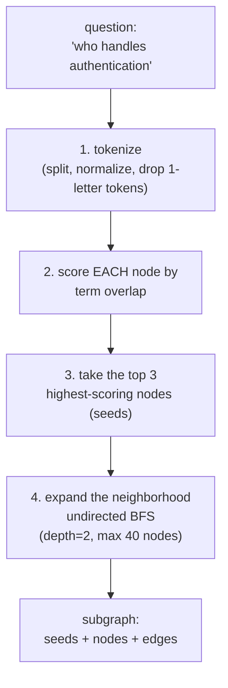
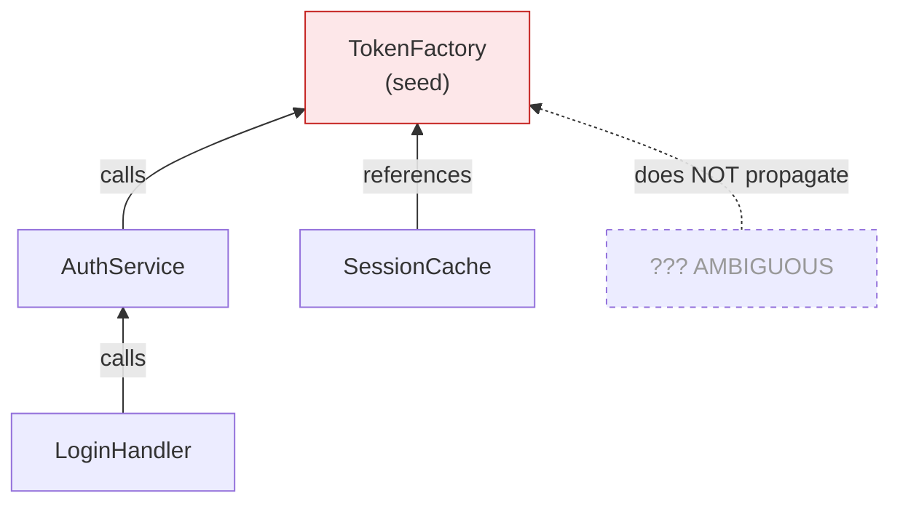
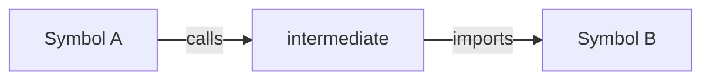
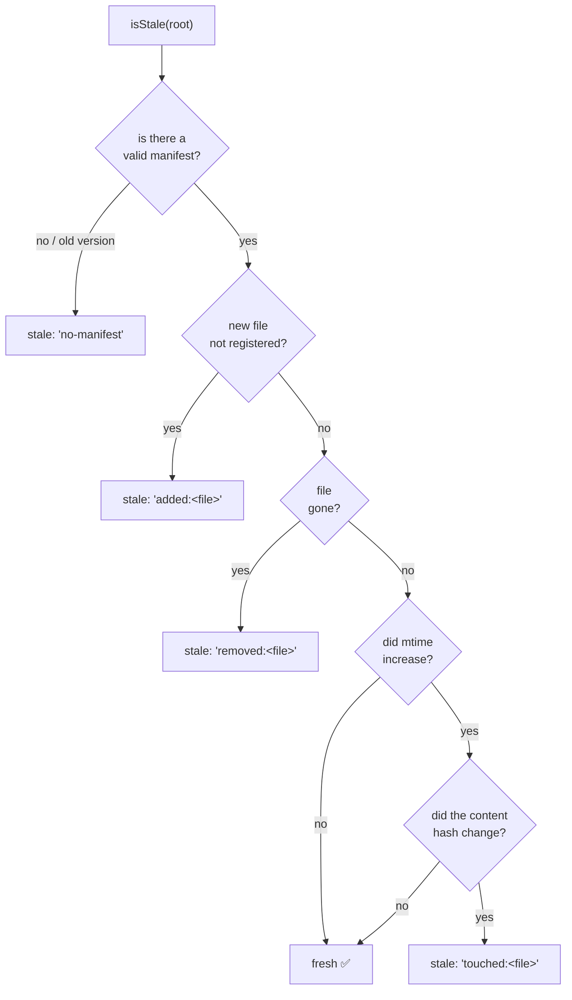
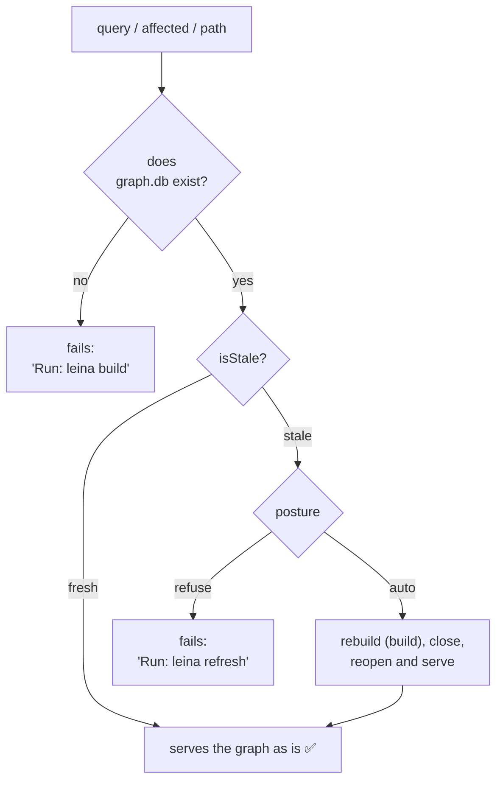

# 3. Search and queries over the graph

> **In one sentence:** on top of the cartographer's map, leina offers three questions —
> *"what's near this?"* (`query`), *"what breaks if I touch this?"* (`affected`) and
> *"how do I get from A to B?"* (`path`)— plus a guardian that makes sure the map is up to date
> before answering.

All three are traversals (BFS) over the graph; they differ in *which direction* they walk and
*what stops them*.

---

## `query` — "what's around this topic?"

It's the GPS that, given a destination in natural language, shows you the neighborhood. It runs
four steps:

The **scoring** rewards more specific matches:

| Term match against... | Points |
|---|---|
| **exact** label match | +100 |
| label **starts with** the term | +10 |
| label **contains** the term | +3 |
| the file's **path** contains the term | +1 |

All terms are summed; results are sorted highest to lowest; the **top 3** are the *seeds*.
From there, the neighborhood is expanded in **both directions** (out + in edges) up to
depth 2 or until it collects 40 nodes. The result is a focused subgraph: the most
relevant corners and the streets that connect them.

> **Why this isn't vector RAG:** a vector store answers "what *resembles* this?". `query`
> answers "what is *connected* to this, and how?". For code, the second question is the one
> that matters.

---

## `affected` — "what breaks if I touch this?" (blast radius)

Before renaming or migrating a symbol, you want to know **who depends on it**. `affected` runs
a **backward** BFS: it starts at the seed node and walks **only inbound edges** (`inEdges`),
level by level, up to `depth` (3 by default).

Two rules make the result **trustworthy**:

1. **Only certain relations propagate impact**: `calls`, `references`,
   `imports`, `imports_from`, `inherits`, `extends`, `implements`, `uses`. A `contains` or
   `method` edge (purely structural) doesn't count as "affects you".
2. **`AMBIGUOUS` edges do NOT propagate.** A blast radius has to be trustworthy; a guessed
   edge points at an arbitrary candidate, so it's ignored. (This is where distinguishing
   `EXTRACTED`/`INFERRED`/`AMBIGUOUS` at extraction time pays off — see
   [The graph](./02-grafo.md#el-edge-la-calle).)

Each hit reports the `node`, the `depth` at which it was reached, and the `viaRelation`.

---

## `path` — "how does A connect to B?"

`path` is a BFS over the **undirected view** (looks at both out and in edges), capped at
8 hops. It keeps track of each node's predecessor; as soon as it touches the destination, it
reconstructs the chain of steps backward.

It's useful for answering "how does the CLI reach the database?" by showing the concrete chain
of calls/imports that links the two ends. Returns `null` if there's no path within the limit.

---

## The *freshness gate*

Here's the magic that avoids answering with a stale map. The cartographer saved, at build time, a
**manifest** with the fingerprint of every source file. Before each read, a guardian compares the
current state against that fingerprint.

### How the map is detected as stale

The staleness check compares the current sources against the manifest and returns at the
**first** sign of staleness (so the reason is deterministic):

The fine detail: a newer `mtime` alone **isn't enough** to declare staleness. It's confirmed with the
**content hash** (SHA-256). That way, a `git checkout` or a "save without editing" that only
touches the `mtime` but leaves the content unchanged does **not** trigger an unnecessary rebuild.

### Auto vs refuse: the *posture*

When the map is stale, what do we do? The gate decides based on the configured *posture*:

- **`auto`** (default): rebuilds on its own, warns via `stderr` and answers with the fresh map.
  The writer and the reader never coexist (build → close → reopen).
- **`refuse`**: doesn't touch anything; tells you to run `leina refresh` yourself.

The `import()` of the build stack is **dynamic** and only happens on the `auto` branch when needed:
that way, the common path (fresh map) never loads the heavy extraction stack, and that's why a
`query` starts up in ~0.15s.

> **Refresh via hook:** besides this gate, the `PostToolUse` hook triggers
> `leina refresh` when the agent edits or writes files — see
> [Hooks and injection](./06-hooks-e-inyeccion.md). Between the gate and the hook, the map stays
> up to date without anyone having to think about it.

---

## To continue

- The repo's other employee, the librarian → [Project memory](./04-memoria.md)
- How `affected` is used to validate stale notes → [Graph–memory communication](./05-comunicacion-grafo-memoria.md)
