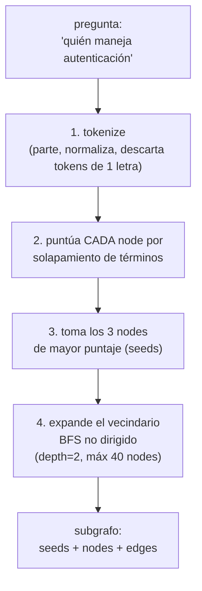
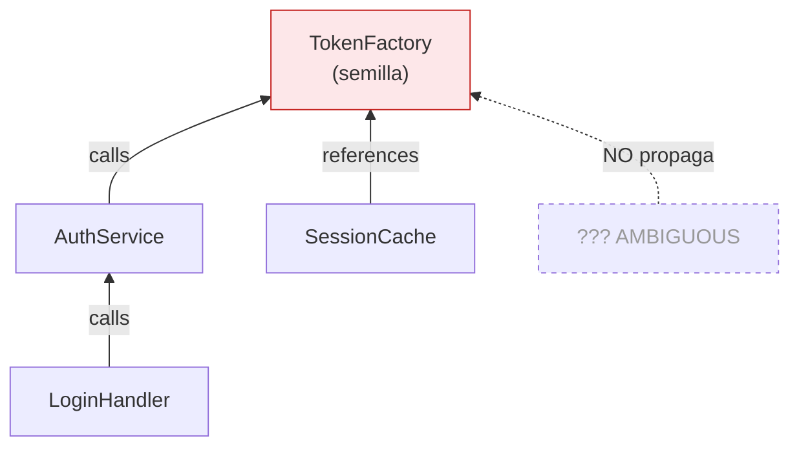
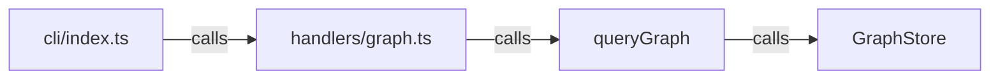
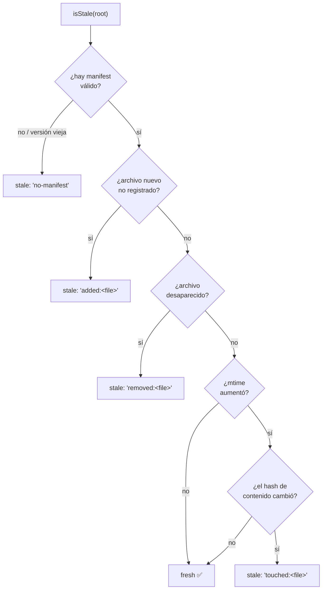
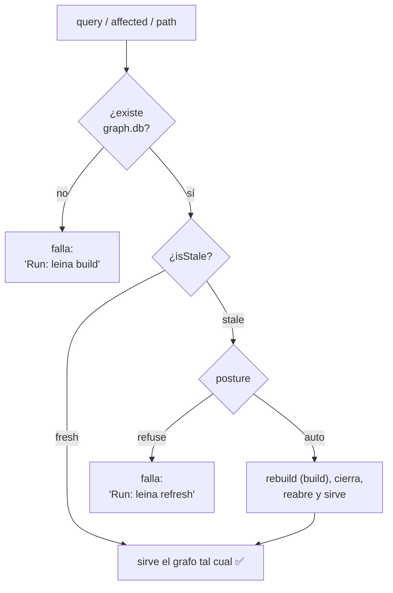

# 3. Búsqueda y consultas sobre el grafo

> **En una frase:** sobre el mapa del cartógrafo, leina ofrece tres preguntas —
> *"¿qué hay cerca de esto?"* (`query`), *"¿qué se rompe si toco esto?"* (`affected`) y
> *"¿cómo llego de A a B?"* (`path`)— y un guardián que se asegura de que el mapa esté al día
> antes de responder.

Toda la lógica vive en <ref_file file="src/application/graph/query.ts" />. Las tres son recorridos (BFS) sobre el grafo;
cambian en *qué dirección* caminan y *qué frenan*.

---

## `query` — "¿qué hay alrededor de este tema?"

Es el GPS que, dado un destino en lenguaje natural, te muestra el barrio. `queryGraph` hace
cuatro pasos:

El **scoring** (`scoreNode`) premia los matches más específicos:

| Coincidencia del término contra... | Puntos |
|---|---|
| label **exacto** | +100 |
| label **empieza con** el término | +10 |
| label **contiene** el término | +3 |
| el **path** del archivo contiene el término | +1 |

Se suman todos los términos; se ordena de mayor a menor; los **3 primeros** son las *seeds*.
Desde ahí, `expandNeighborhood` camina en **ambas direcciones** (out + in edges) hasta
profundidad 2 o hasta juntar 40 nodes. El resultado es un subgrafo enfocado: las esquinas más
relevantes y las calles que las conectan.

> **Por qué no es RAG vectorial:** un vector store responde "¿qué se *parece* a esto?". `query`
> responde "¿qué está *conectado* a esto, y cómo?". Para código, la segunda pregunta es la que
> importa.

---

## `affected` — "¿qué se rompe si toco esto?" (blast radius)

Antes de renombrar o migrar un símbolo, querés saber **quién depende de él**. `affected` hace
un BFS **hacia atrás**: parte del nodo semilla y camina **solo por edges entrantes** (`inEdges`),
nivel por nivel, hasta `depth` (por defecto 3).

Dos reglas hacen que el resultado sea **confiable** (`affectedHitFor`):

1. **Solo ciertas relaciones propagan impacto** (`AFFECTED_RELATIONS`): `calls`, `references`,
   `imports`, `imports_from`, `inherits`, `extends`, `implements`, `uses`. Un edge `contains` o
   `method` (puramente estructural) no cuenta como "te afecta".
2. **Los edges `AMBIGUOUS` NO propagan.** Un blast radius tiene que ser de fiar; un edge
   adivinado apunta a un candidato arbitrario, así que se ignora. (Acá se paga el haber
   distinguido `EXTRACTED`/`INFERRED`/`AMBIGUOUS` en la extracción — ver
   [El grafo](./02-grafo.md#el-edge-la-calle).)

Cada hit reporta el `node`, la `depth` a la que se alcanzó y la `viaRelation`.

---

## `path` — "¿cómo se conecta A con B?"

`shortestPath` es un BFS sobre la **vista no dirigida** (mira out *e* in edges), con tope de
8 saltos. Va guardando el predecesor de cada nodo; en cuanto toca el destino, reconstruye la
cadena de pasos hacia atrás.

Sirve para responder "¿cómo llega la CLI a la base de datos?" mostrando la cadena concreta de
llamadas/imports que une los dos extremos. Devuelve `null` si no hay camino dentro del límite.

---

## El *freshness gate*

Acá está la magia que evita responder con un mapa viejo. El cartógrafo guardó, al construir, un
**manifest** con la huella de cada archivo fuente. Antes de cada lectura, un guardián compara el
estado actual contra esa huella.

### Cómo se detecta que el mapa quedó viejo (`isStale`)

`isStale` (<ref_file file="src/application/graph/manifest.ts" />) compara las fuentes actuales contra el manifest y
devuelve al **primer** signo de obsolescencia (para que la razón sea determinista):

El detalle fino: un `mtime` más nuevo **no alcanza** para declarar stale. Se confirma con el
**hash de contenido** (SHA-256). Así, un `git checkout` o un "guardar sin editar" que solo
mueve el `mtime` pero deja el contenido igual **no** dispara un rebuild innecesario.

### Auto vs refuse: la *posture*

Cuando el mapa está stale, ¿qué hacemos? Lo decide `openFreshStore`
(<ref_snippet file="src/cli/wiring.ts" lines="87-108" />) según la *posture* configurada:

- **`auto`** (por defecto): reconstruye solo, avisa por `stderr` y responde con el mapa fresco.
  El writer y el reader nunca coexisten (build → close → reopen).
- **`refuse`**: no toca nada; te dice que corras `leina refresh` vos mismo.

El `import()` de `buildGraph` es **dinámico** y ocurre solo en la rama `auto` cuando hace falta:
así, el camino común (mapa fresco) jamás carga el pesado stack de extracción, y por eso una
`query` arranca en ~0.15s.

> **El refresh por hook:** además de este gate, el hook `PostToolUse` dispara
> `leina refresh` cuando el agente edita o escribe archivos — ver
> [Hooks e inyección](./06-hooks-e-inyeccion.md). Entre el gate y el hook, el mapa se mantiene
> al día sin que nadie lo piense.

---

## Para seguir

- El otro empleado del repo, el bibliotecario → [La memoria de proyecto](./04-memoria.md)
- Cómo `affected` se usa para validar notas viejas → [Comunicación grafo–memoria](./05-comunicacion-grafo-memoria.md)
