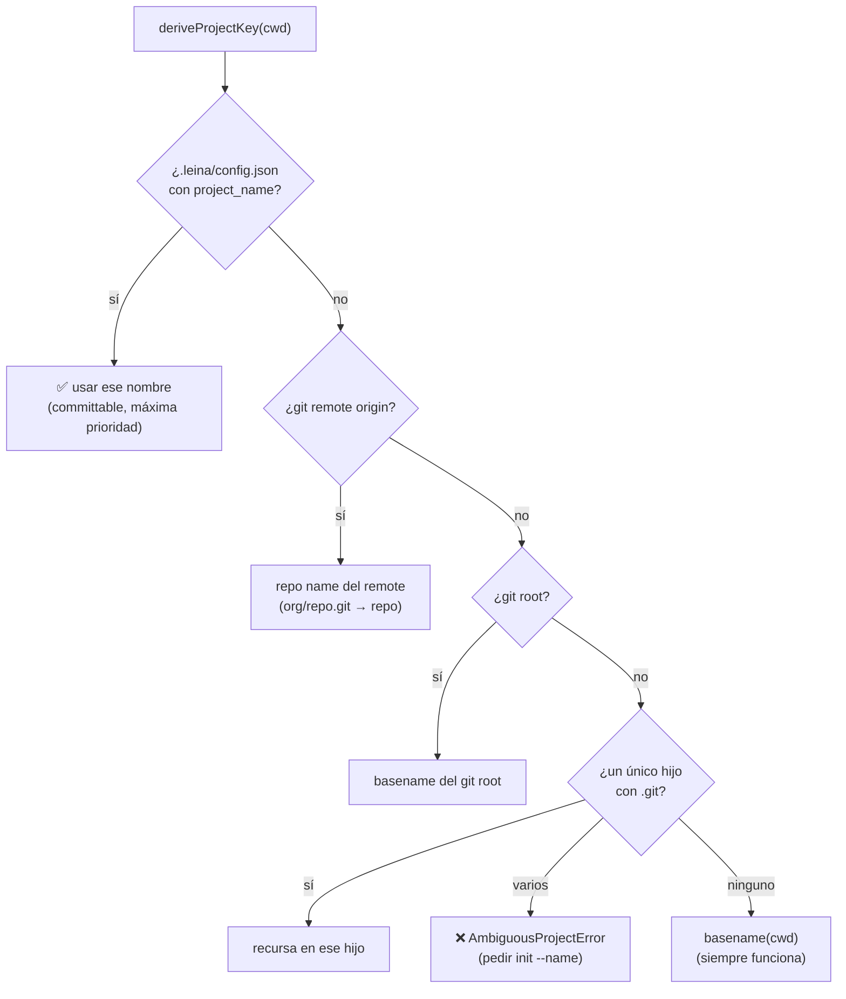
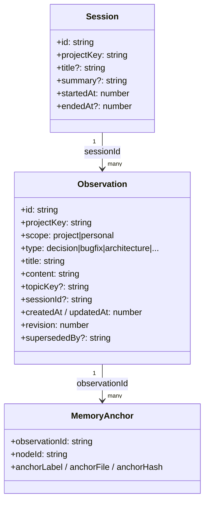
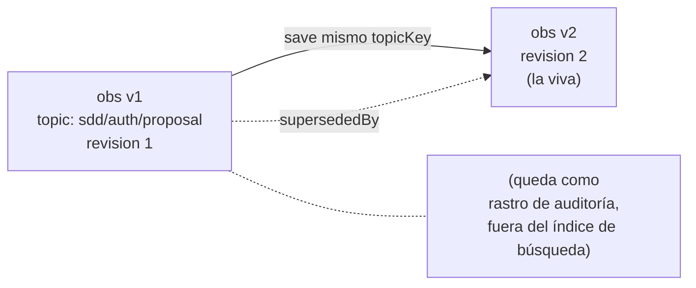
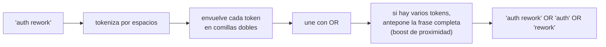

# 4. La memoria de proyecto

> **En una frase:** la memoria es el *diario de bitácora* del proyecto — anota decisiones, bugs
> resueltos y convenciones para que la IA no las re-descubra en cada sesión— y vive en **una
> sola base global** segmentada por proyecto.

El grafo sabe *qué ES* el código. La memoria sabe *por qué* llegó a ser así. Es la diferencia
entre leer el plano de un edificio y leer las notas del arquitecto sobre por qué movió esa
columna.

---

## Dónde vive y cómo se segmenta

A diferencia del grafo (un `graph.db` por repo), **toda** la memoria vive en una única base
global: `~/.leina/memory.db`. No se necesita inicializar el proyecto; la memoria es
always-on.

¿Cómo no se mezclan los proyectos entonces? Con el **project key**: una etiqueta estable que
segmenta cada observación. Es como un diario compartido donde cada proyecto tiene su propia
solapa.

### Derivación del project key

`deriveProjectKey` (<ref_file file="src/application/project/detect-key.ts" />) baja por una **cascada fail-open**: usa la
primera fuente que funcione.

El resultado se normaliza (`normalizeProjectKey`): NFKC, minúsculas, separadores de path → `-`,
colapsa no-alfanuméricos a un solo `-`. **Importante:** los project keys usan **guiones**, no
guiones bajos (al revés que los IDs de node del grafo, que usan `_`). Eso mantiene los dos
namespaces separados.

Si el `cwd` no es un repo git y hay **varios** repos hijos, se lanza `AmbiguousProjectError`:
hay que fijar el nombre con `leina init --name <name>` (escribe el `config.json`
committable).

---

## El modelo: observations y sessions

Definido en <ref_file file="src/domain/memory/model.ts" />.

### La `observation` (una entrada del diario)

Es un hecho fechado y **tipado** sobre el proyecto. El `type` clasifica la naturaleza:

| `type` | Para qué |
|--------|----------|
| `decision` | una decisión de diseño y su porqué |
| `bugfix` | un bug y cómo se resolvió |
| `architecture` | una descripción estructural |
| `discovery` | un hallazgo no obvio |
| `pattern` | un patrón recurrente del código |
| `config` | algo de configuración |
| `preference` | una preferencia del equipo/usuario |
| `manual` | nota libre |

Esta distinción de `type` reaparece en el [drift detection](./05-comunicacion-grafo-memoria.md):
algunos tipos son *descriptivos* (caducan cuando el código cambia) y otros *normativos* (reglas
que siguen valiendo aunque el código se mueva).

### El `topicKey` y el upsert (evolucionar una entrada en su lugar)

Si guardás una observación con un `topicKey` (un slug estable como `sdd/auth-rework/proposal`) y
después guardás otra con el **mismo** `topicKey`, la vieja **no** se borra: se marca
`supersededBy` (sigue como rastro de auditoría) y la nueva toma su lugar con `revision`
incrementada. Es un diario donde podés *editar una página* sin perder las versiones anteriores.

### La `session` (un turno de trabajo)

Agrupa observaciones de una misma sesión de trabajo (`startedAt`/`endedAt`). Al final de una
sesión, `leina memory session <dir> --content "..."` guarda un resumen.

---

## Cómo se guarda (el `memory.db`)

`SQLiteMemoryRepository` (<ref_file file="src/infrastructure/sqlite/memory-repository.ts" />) implementa el port
`MemoryRepository`. El schema vive en <ref_file file="src/infrastructure/sqlite/schema.ts" /> (versión 4) y tiene cuatro
piezas:

| Tabla | Qué guarda |
|-------|-----------|
| `sessions` | sesiones (indexada por `project_key, started_at DESC` para recencia) |
| `observations` | las entradas del diario; `topic_key` con índice único **parcial** (solo filas vivas, `superseded_by IS NULL`) |
| `obs_fts` | tabla virtual **FTS5** para búsqueda full-text |
| `memory_anchors` | los post-its que unen una observación con nodes del grafo (ver [cap. 5](./05-comunicacion-grafo-memoria.md)) |

### FTS5: la búsqueda full-text

`obs_fts` es una tabla virtual FTS5 en modo *external-content* que indexa `title` y `content`.
Dos detalles del tokenizer importan:

- **porter** (stemming en inglés): "running" matchea "run".
- **unicode61 + remove_diacritics**: búsqueda insensible a acentos — clave para escribir el
  diario en español ("migración" matchea "migracion").

**Triggers guardados:** solo las observaciones **vivas** (`superseded_by IS NULL`) entran al
índice. Las versiones superseded quedan en la tabla base (auditoría) pero **nunca puntúan** en
las búsquedas. Hay tres triggers (`obs_ai`, `obs_au`, `obs_ad`) que custodian INSERT/UPDATE/
DELETE para mantener esa invariante.

---

## Cómo se busca (BM25)

`searchMemory` (<ref_file file="src/application/memory/query.ts" />) delega en el repositorio, que corre una query FTS5
rankeada por **BM25**. Lo interesante es cómo se **sanitiza** la consulta antes de mandarla a
FTS5:

La estrategia es **recall-first**: unir con `OR` hace que matchee cualquier término, y BM25
ordena los mejores hits primero. La frase completa como término extra le da un empujón a los
documentos donde las palabras aparecen juntas. Cada `SearchHit` trae `id`, `title`, `type`,
`topicKey`, un `snippet` (primeros ~200 chars), el score BM25 y `updatedAt`.

Comandos de lectura:

- `leina memory search <dir> "<query>"` — búsqueda cruda (lo de arriba).
- `leina memory context <dir>` — sesiones recientes + últimas observaciones.
- `leina memory verified <dir> "<query>"` — búsqueda **+ chequeo de drift** contra el
  grafo. Eso es justo el tema del próximo capítulo.

---

## Para seguir

- Cómo el bibliotecario sabe que una nota quedó vieja → [Comunicación grafo–memoria](./05-comunicacion-grafo-memoria.md)
- Cómo se inyecta este diario al agente sin que lo pida → [Hooks e inyección](./06-hooks-e-inyeccion.md)
