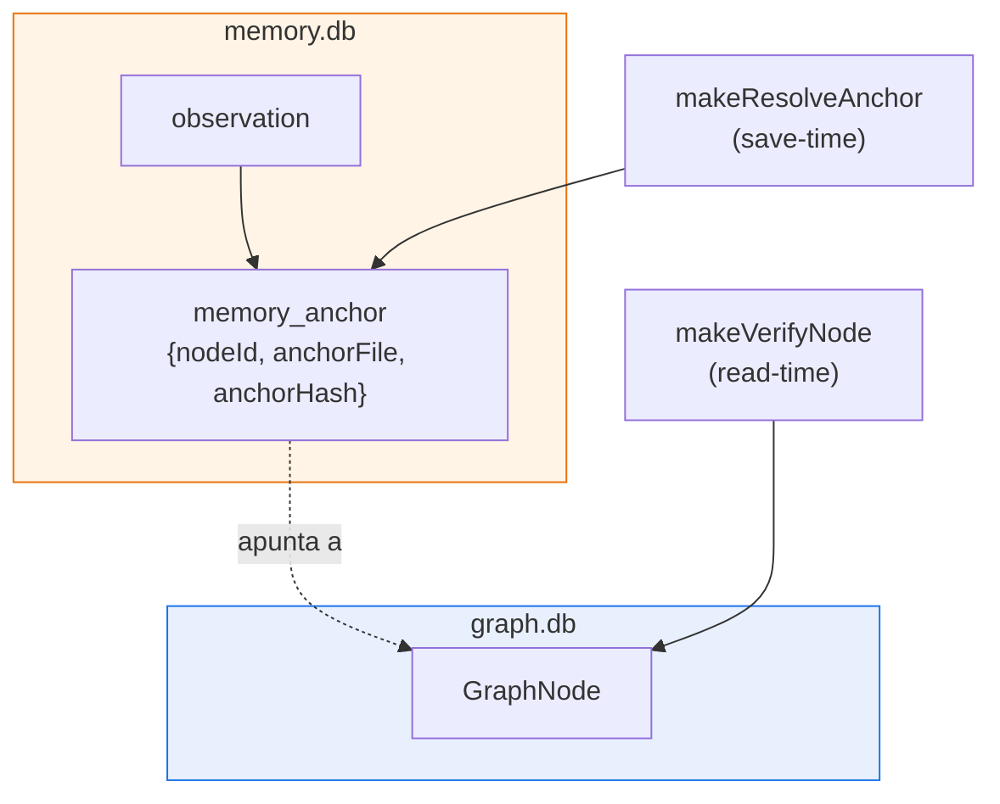
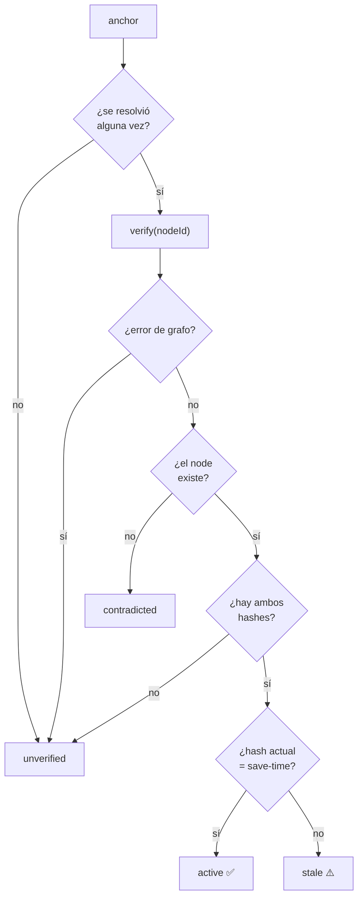
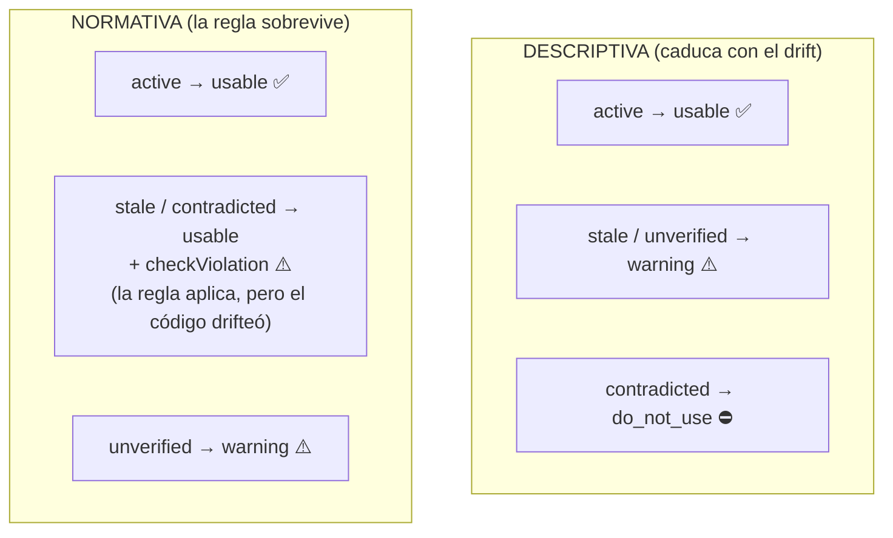
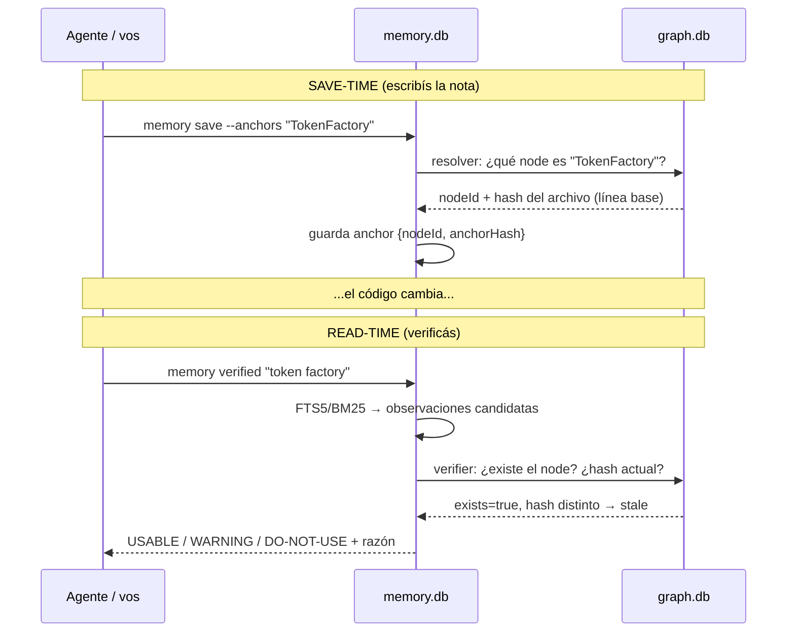

# 5. Cómo se hablan el grafo y la memoria (drift detection)

> **En una frase:** las observaciones de memoria se "clavan" a nodes del grafo con *post-its*
> (`anchors`); cuando el código cambia, leina compara el estado guardado contra el grafo
> vivo y clasifica cada nota como **USABLE**, **WARNING** o **DO-NOT-USE**.

Este es el capítulo donde el cartógrafo y el bibliotecario por fin se dan la mano.

---

## Dos bases separadas, una conversación

Recordá: el grafo (`graph.db`, por repo) y la memoria (`memory.db`, global) están
**desacoplados en disco**. La memoria nunca importa `GraphStore` directamente. Se unen en la
**capa de aplicación**, en el composition root `openMemoryRepo`
(<ref_snippet file="src/cli/wiring.ts" lines="40-67" />), que le pasa a la memoria dos funciones que *saben* hablar
con el grafo: un **resolver** (para clavar post-its) y un **verifier** (para revisarlos).

El grafo se abre **lazy**: solo si realmente se ejercitan anchors *y* existe un `graph.db`. Si
no hay grafo, los anchors quedan sin resolver (estado `unverified`) y nada se rompe.

---

## El post-it: cómo se clava un anchor

Pensá un anchor como una nota adhesiva pegada a una página de un libro que se reescribe. Cuando
guardás una observación con `--anchors "TokenFactory"`, en **save-time** ocurre
(`makeResolveAnchor`, <ref_file file="src/application/memory/anchor-verify.ts" />):

1. Se busca en el grafo el/los node(s) cuyo label coincide **exacto** (functional-exact, sin
   substring difuso) con `"TokenFactory"`.
2. Para cada match se lee la **huella del archivo** (SHA-256) desde el manifest del build.
3. Se guarda en `memory_anchors`: `nodeId`, `sourceFile` y ese `anchorHash` de save-time.

Ese hash es la foto del archivo *en el momento en que escribiste la nota*. Es la línea base
contra la que después se mide el drift. Si el label no resuelve (no hay grafo, no hay match), el
anchor se guarda igual pero sin `nodeId` → quedará `unverified`. **Fail-open:** cualquier error
devuelve `[]`, nunca rompe el save.

---

## La revisión: detectar drift en read-time

Cuando corrés `leina memory verified`, el bibliotecario revisa cada post-it
**en el momento de leer** (nunca se persiste el resultado). Para cada anchor, `makeVerifyNode`
pregunta al grafo: *¿este node todavía existe? ¿cuál es el hash actual del archivo en el disco?*
Y `deriveAnchorState` (<ref_file file="src/application/memory/query.ts" />) decide el estado:

Los cuatro estados (`MemoryState`):

| Estado | Significa | El post-it... |
|--------|-----------|---------------|
| `active` | el node existe y el archivo **no cambió** | sigue pegado y vigente |
| `stale` | el node existe pero el **archivo cambió** | sigue pegado, pero la página se reescribió |
| `contradicted` | el node **ya no existe** en el grafo | la página fue arrancada |
| `unverified` | nunca resolvió a un node, o el grafo no está disponible | no sabemos contra qué página estaba |

Cuando una observación tiene **varios** anchors, `deriveMemoryState` agrega: gana el peor caso
(`contradicted` > `stale` > `unverified` > `active`).

---

## El veredicto: descriptive vs normative

Acá está la sutileza más importante. No todas las notas envejecen igual:

- Una nota **descriptiva** ("este módulo cachea sesiones en memoria") describe *cómo es* el
  código. Si el código cambió, la descripción **caducó**.
- Una nota **normativa** ("NUNCA loguear el token en claro") es una *regla*. Aunque el código
  cambie, la regla **sigue valiendo** — de hecho, si el código drifteó, lo que querés es chequear
  que no se haya *violado*.

El `type` de la observación define su `nature`: tipos como `architecture`/`bugfix` son
**descriptivos**; `decision`/`preference` son **normativos**. La clasificación final
(`classify`) cruza `nature` × `state` para dar un `verdict`:

| Veredicto | Qué le dice al agente |
|-----------|------------------------|
| `usable` | confiá en esta nota |
| `warning` | usala con cuidado; puede estar desactualizada o no se pudo verificar |
| `do_not_use` | esta descripción ya no aplica; ignorala |

`getVerifiedContext` arma la respuesta completa: busca las observaciones que matchean la query,
deriva el estado de cada una contra el grafo vivo, y las reparte en `usable` / `warning` /
`doNotUse` con su razón. Así el agente no solo recibe *qué* se anotó, sino *cuánto puede
confiar* en cada nota hoy.

---

## El ciclo completo, de punta a punta

> **Por qué read-time y no persistido:** el estado de drift se deriva al vuelo. Eso mantiene la
> memoria fresca sin re-chequeos constantes, y significa que la *misma* nota puede pasar de
> `usable` a `stale` simplemente porque el código cambió — sin tocar la base de memoria.

---

## Para seguir

- Cómo toda esta inteligencia llega al agente sin que la pida → [Hooks e inyección](./06-hooks-e-inyeccion.md)
- De dónde sale el `affected` que conviene correr antes de migrar → [Búsqueda y consultas](./03-busqueda-y-consultas.md#affected--qué-se-rompe-si-toco-esto-blast-radius)
