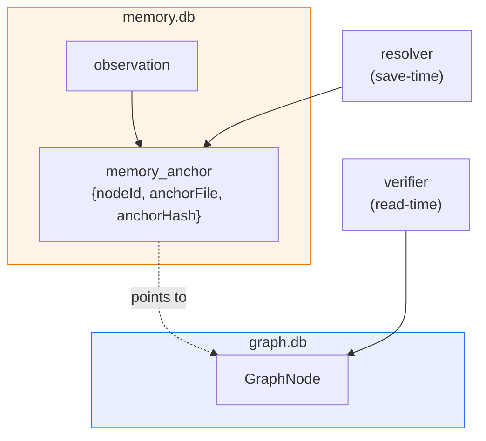
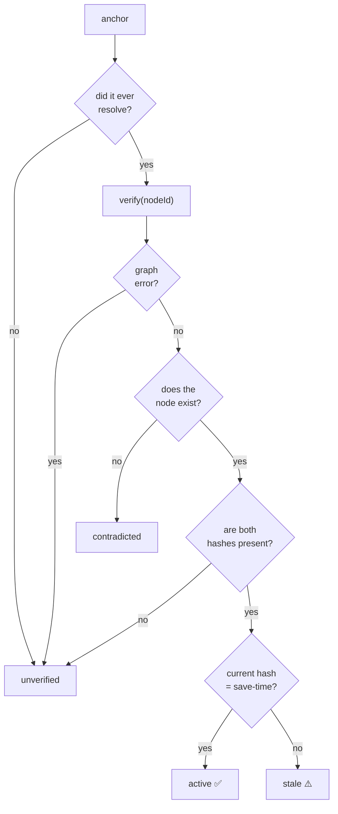
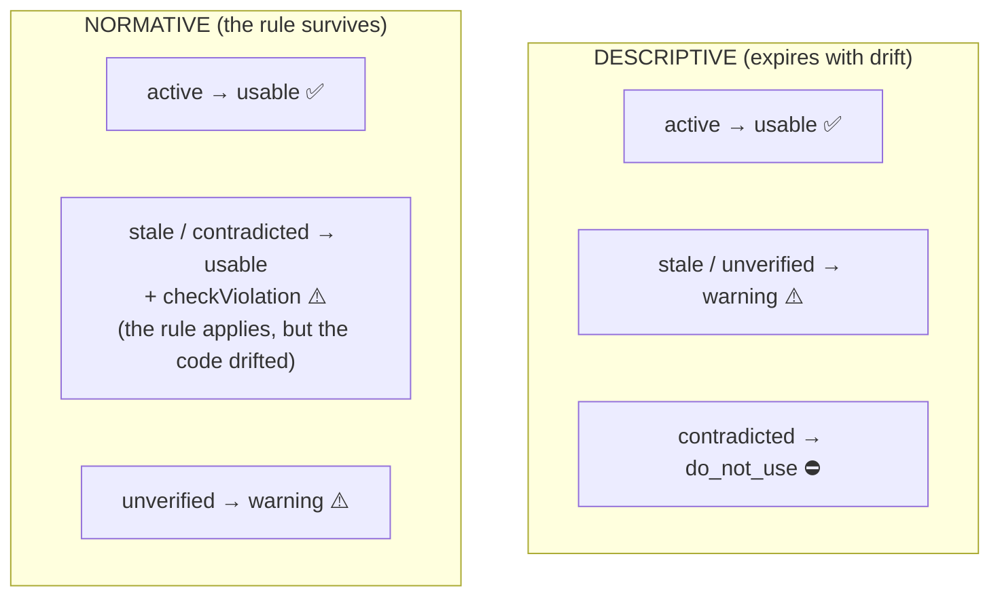
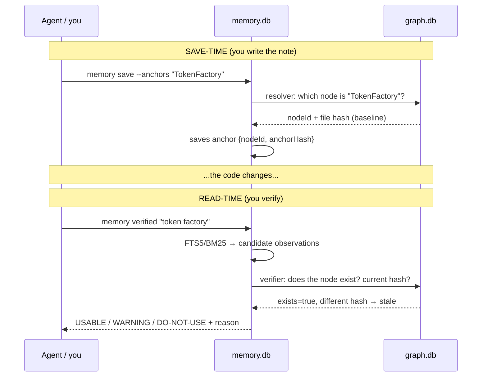

# 5. How the graph and memory talk to each other (drift detection)

> **In one sentence:** memory observations get "pinned" to graph nodes with *sticky notes*
> (`anchors`); when the code changes, leina compares the saved state against the
> live graph and classifies each note as **USABLE**, **WARNING**, or **DO-NOT-USE**.

This is the chapter where the cartographer and the librarian finally shake hands.

---

## Two separate databases, one conversation

Remember: the graph (`graph.db`, per repo) and memory (`memory.db`, global) are
**decoupled on disk**. Memory never touches the graph store directly. They come together in the
**application layer**, at the composition root, which hands memory two functions that *know* how
to talk to the graph: a **resolver** (to pin sticky notes) and a **verifier** (to check them).

The graph is opened **lazily**: only if anchors are actually exercised *and* a `graph.db` exists. If
there's no graph, anchors are left unresolved (`unverified` state) and nothing breaks.

---

## The sticky note: how an anchor gets pinned

Think of an anchor as an adhesive note stuck to a page of a book that keeps getting rewritten. When you
save an observation with `--anchors "TokenFactory"`, at **save-time** the following happens:

1. The graph is searched for the node(s) whose label matches **exactly** (functional-exact, no
   fuzzy substring) `"TokenFactory"`.
2. For each match, the **file fingerprint** (SHA-256) is read from the build manifest.
3. `memory_anchors` stores: `nodeId`, `sourceFile`, and that save-time `anchorHash`.

That hash is the snapshot of the file *at the moment you wrote the note*. It's the baseline
against which drift is later measured. If the label doesn't resolve (no graph, no match), the
anchor is still saved but without `nodeId` → it will remain `unverified`. **Fail-open:** any error
returns `[]`, and the save is never broken.

---

## The review: detecting drift at read-time

When you run `leina memory verified`, the librarian reviews each sticky note
**at the moment of reading** (the result is never persisted). For each anchor, the verifier
asks the graph: *does this node still exist? what is the file's current hash on disk?*
And the anchor state is decided:

The four states (`MemoryState`):

| State | Meaning | The sticky note... |
|--------|-----------|---------------|
| `active` | the node exists and the file **hasn't changed** | is still stuck on, and current |
| `stale` | the node exists but the **file changed** | is still stuck on, but the page was rewritten |
| `contradicted` | the node **no longer exists** in the graph | the page was torn out |
| `unverified` | it never resolved to a node, or the graph isn't available | we don't know which page it was against |

When an observation has **several** anchors, the aggregation takes the worst case
(`contradicted` > `stale` > `unverified` > `active`).

---

## The verdict: descriptive vs normative

Here's the most important subtlety. Not all notes age the same way:

- A **descriptive** note ("this module caches sessions in memory") describes *what the*
  code *is like*. If the code changed, the description **has expired**.
- A **normative** note ("NEVER log the token in plaintext") is a *rule*. Even if the code
  changes, the rule **still holds** — in fact, if the code has drifted, what you want is to check
  that it hasn't been *violated*.

The observation's `type` defines its `nature`: types like `architecture`/`bugfix` are
**descriptive**; `decision`/`preference` are **normative**. The final classification
crosses `nature` × `state` to produce a `verdict`:

| Verdict | What it tells the agent |
|-----------|------------------------|
| `usable` | trust this note |
| `warning` | use it with caution; it may be outdated or couldn't be verified |
| `do_not_use` | this description no longer applies; ignore it |

The verified context builds the full response: it looks up the observations that match the query,
derives each one's state against the live graph, and sorts them into `usable` / `warning` /
`doNotUse` with their reason. That way the agent doesn't just receive *what* was noted, but *how much
it can trust* each note today.

---

## The full cycle, end to end

> **Why read-time and not persisted:** the drift state is derived on the fly. That keeps
> memory fresh without constant re-checks, and it means the *same* note can go from
> `usable` to `stale` simply because the code changed — without touching the memory database.

---

## Up next

- How all this intelligence reaches the agent without being asked for it → [Hooks and injection](./06-hooks-e-inyeccion.md)
- Where the `affected` you should run before migrating comes from → [Search and queries](./03-busqueda-y-consultas.md#affected--qué-se-rompe-si-toco-esto-blast-radius)
