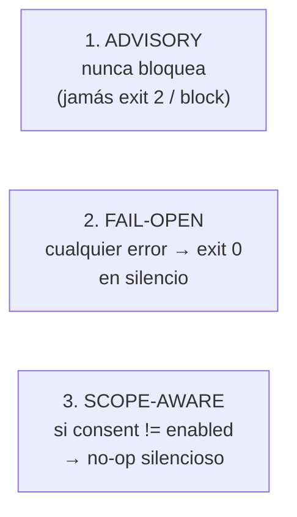
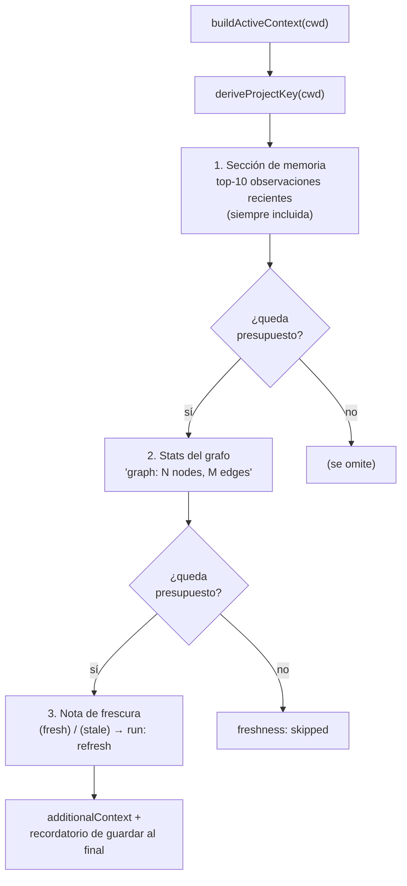
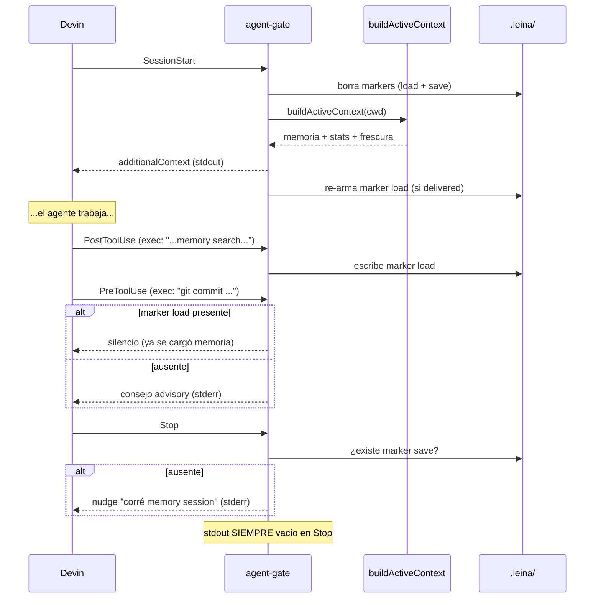

# 6. Hooks de Devin e inyección de contexto

> **En una frase:** los *hooks* son el conserje del repo — al empezar la sesión te dejan en el
> escritorio las notas del bibliotecario y el estado del mapa, al terminar te recuerdan guardar,
> y mientras tanto te dan algún consejo— pero **nunca te traban la puerta**.

Sin hooks, todo leina sería opt-in: la IA tendría que acordarse de correr
`memory context` y `query`. Los hooks hacen que el contexto **llegue solo**.

---

## Qué es un hook y cuándo dispara

Devin emite eventos durante una sesión, conectados a `leina agent-hook <Event>` (alias de compatibilidad: `devin-hook`) por hooks
que se registran a nivel **user-global** (los instala `setup`/`activate`, disparan en todos los
repos y resuelven el root en runtime) o, en modo standalone, en un `.devin/hooks.v1.json` que
escribe `init` (FULL). Los writers que generan ese JSON son funciones puras en
<ref_file file="src/application/install/devin-hooks.ts" />; la lógica de decisión vive en
<ref_file file="src/cli/agent-gate.ts" />.

| Evento | Matcher | Qué hace el conserje |
|--------|---------|----------------------|
| `SessionStart` | (todos) | borra los markers e **inyecta** memoria + stats del grafo |
| `PostCompaction` | (todos) | re-inyecta el contexto tras una compactación |
| `UserPromptSubmit` | (todos) | en el primer turno, inyecta contexto si aún no se cargó |
| `PreToolUse` | `edit\|write\|exec` | consejo advisory (p. ej. ante `git commit` o `grep`) |
| `PostToolUse` | `edit\|write` → `refresh`; `exec` → gate | refresca el grafo; detecta carga/guardado de memoria |
| `Stop` | (todos) | recuerda persistir la sesión si no se guardó |

---

## Las tres garantías de oro

Antes de los flujos, estas tres invariantes explican *todo* el comportamiento:

1. **Advisory only.** El gate nunca devuelve `block`. Como mucho escribe una `reason` en
   `stderr` como empujón de una sola vez; el agente **siempre** procede.
2. **Fail-open.** stdin vacío/inválido, campos faltantes, errores de fs, grafo no disponible →
   `exit 0` en silencio. El sistema nunca crashea al agente.
3. **Scope-aware no-op.** Un hook user-global dispara en *todos* los repos de la máquina. El gate
   solo actúa cuando el flag de consentimiento del repo es `enabled`
   (`isLeinaProject = readConsentFlag(cwd) === "enabled"`, en `.leina/consent`). Si está
   `unknown` (incluidos repos legacy con solo `.devin/hooks.v1.json`) o `disabled`, `runAgentGate`
   retorna en silencio. Así el hook global no molesta en repos ajenos, y el skill `leina-setup`
   pregunta una sola vez en los repos `unknown`.

---

## ¿En qué proyecto estoy? (resolución del root)

Un hook user-global no está fijado a un directorio. ¿Cómo sabe sobre qué repo opera?
`resolveHookProjectRoot` prefiere la variable `DEVIN_PROJECT_DIR` (el contrato documentado de
Devin para decirle a un hook su workspace) y cae a `process.cwd()` si está ausente. Todo lo de
abajo —el scope guard, los markers, la inyección— se ancla a ese root.

---

## Inyección activa: qué se le pone en el escritorio

El corazón es `buildActiveContext(cwd)` (<ref_file file="src/cli/active-context.ts" />). Arma un bloque de
`additionalContext` con tres partes, bajo un **presupuesto de 2500ms** que degrada con gracia:

- **Memoria** (`readMemorySection`): las 10 observaciones más recientes del proyecto, con
  título, `type` y un snippet de ~200 chars, hasta un tope de 4000 chars. Si no hay
  observaciones aún, inyecta `## Project memory\n(no observations yet)`.
- **Grafo** (`readGraphStatsPart`): el conteo `N nodes, M edges` leído del `graph.db`.
- **Frescura** (`computeFreshnessNote`): corre `isStale` y agrega `(fresh)` o `(stale)` con la
  sugerencia de `refresh` (o `build` si no hay grafo todavía).

Si todo falla, cae a `SESSION_START_CONTEXT`: un texto estático que le recuerda al agente correr
`memory context` y preferir `query`/`affected` sobre grep. La función devuelve además un flag
`delivered` que el gate usa para decidir si re-armar el marker de carga.

---

## Los markers: el estado por-sesión

El conserje lleva dos banderitas en `<cwd>/.leina/`, que se **borran al SessionStart**
(semántica por-sesión) y se vuelven a poner cuando corresponde:

| Marker | Archivo | Quién lo escribe | Para qué |
|--------|---------|------------------|----------|
| **load** | `session.memory-loaded` | `PostToolUse` cuando un `exec` corre `memory (context\|search\|verified)`; o la inyección exitosa | corta en seco los consejos una vez que la memoria ya se cargó |
| **save** | `session.memory-saved` | `PostToolUse` cuando un `exec` corre `memory (save\|session\|update)` | lo lee `Stop` para decidir si recordar guardar |

El marker de save excluye `session-start` con un lookahead negativo en el regex (no querés que
abrir una sesión cuente como "ya guardaste").

---

## Un turno completo, de SessionStart a Stop

Detalles por evento (`decideAgentGate` / `runAgentGate`):

- **SessionStart**: borra ambos markers e inyecta contexto; re-arma el marker load si la entrega
  fue exitosa.
- **PostCompaction**: re-inyecta igual que SessionStart pero **sin** resetear los markers (el
  campo `summary` se ignora a propósito; la re-inyección es incondicional).
- **UserPromptSubmit**: si el marker load ya existe → silencio total (la inyección ya pasó). Si
  no, inyecta por `stdout` y escribe el marker. Sin advisory por stderr (la inyección lo
  reemplaza).
- **PreToolUse**: con `git commit` emite un consejo de cargar memoria; con `grep`/`rg`/`find`
  emite un consejo de usar `leina query`/`affected`. Si el marker load existe, calla.
- **PostToolUse**: escribe el marker load o save según el comando `exec`; en `edit`/`write`
  dispara `leina refresh` para mantener el grafo al día (ver
  [Búsqueda y consultas](./03-busqueda-y-consultas.md#el-freshness-gate)).
- **Stop**: si falta el marker save, emite el nudge por `stderr`. **stdout siempre vacío.**
  Nunca bloquea (exit 0 en todas las ramas).

---

## doctor: ¿está listo para inyectar?

`leina doctor` (<ref_file file="src/cli/doctor.ts" />) chequea la *injection-readiness*: que exista el
`globalMemoryPath()` y el `graph.db`, para detectar un estado degradado donde la inyección
activa funcionaría a medias. Una invariante clave: **doctor nunca abre SQLite** — todos los
chequeos son solo de filesystem (stat, leer texto/JSON). Eso evita efectos colaterales (WAL/SHM)
y lo mantiene rápido y seguro.

---

## Cierre del recorrido

Con esto cerramos el círculo de la analogía:

- el **cartógrafo** levanta el mapa ([grafo](./02-grafo.md)) y lo mantiene fresco
  ([búsqueda](./03-busqueda-y-consultas.md));
- el **bibliotecario** lleva el diario ([memoria](./04-memoria.md)) y sabe qué notas
  envejecieron ([drift](./05-comunicacion-grafo-memoria.md));
- el **conserje** (este capítulo) hace que todo eso llegue al agente en el momento justo, sin
  trabarle nunca la puerta.

Volvé al [índice](./README.md) para releer cualquier pieza.
