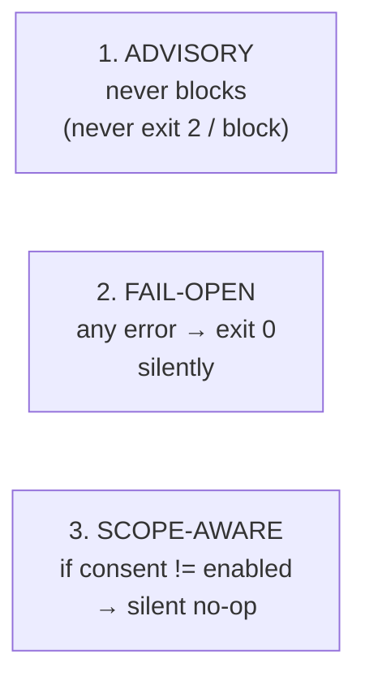
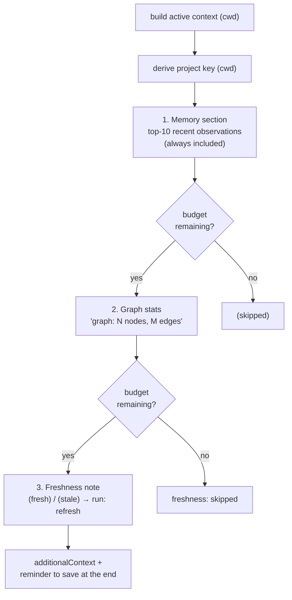
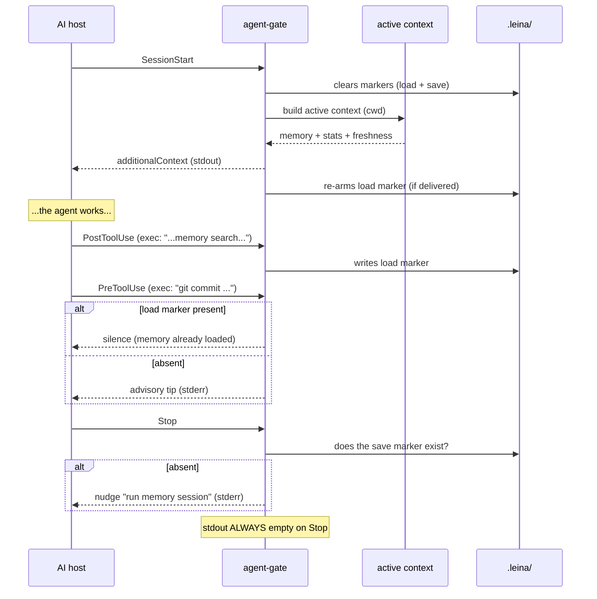

# 6. Agent hooks and context injection

> **In one sentence:** *hooks* are the concierge of the repo — at the start of the session they
> leave the librarian's notes and the state of the map on your desk, at the end they remind you
> to save, and along the way they offer some advice — but **they never lock the door on you**.

Without hooks, all of leina would be opt-in: the AI would have to remember to run
`memory context` and `query`. Hooks make the context **arrive on its own**.

---

## What a hook is and when it fires

Your AI host (Devin or Claude Code) emits events during a session, wired to
`leina agent-hook <Event>` (compatibility alias: `devin-hook`). Hooks are registered either at the **user-global** level (installed by
`setup`/`activate`, they fire in every repo and resolve the root at runtime) or, in standalone
mode, in a `.devin/hooks.v1.json` written by a full `init`. The JSON is produced by pure
writers, and a single gate holds the decision logic.

| Event | Matcher | What the concierge does |
|--------|---------|----------------------|
| `SessionStart` | (all) | clears the markers and **injects** memory + graph stats |
| `PostCompaction` | (all) | re-injects the context after a compaction |
| `UserPromptSubmit` | (all) | on the first turn, injects context if it hasn't loaded yet |
| `PreToolUse` | `edit\|write\|exec` | advisory tip (e.g. before `git commit` or `grep`) |
| `PostToolUse` | `edit\|write` → `refresh`; `exec` → gate | refreshes the graph; detects memory load/save |
| `Stop` | (all) | reminds you to persist the session if it wasn't saved |

---

## The three golden guarantees

Before getting into the flows, these three invariants explain *all* of the behavior:

1. **Advisory only.** The gate never returns `block`. At most it writes a `reason` to `stderr` as
   a one-time nudge; the agent **always** proceeds.
2. **Fail-open.** Empty/invalid stdin, missing fields, fs errors, graph unavailable →
   `exit 0` silently. The system never crashes the agent.
3. **Scope-aware no-op.** A user-global hook fires in *every* repo on the machine. The gate only
   acts when the repo's consent flag is `enabled` (stored in `.leina/consent`). If it's
   `unknown` or `disabled`, the gate returns silently. This way the global hook doesn't bother
   other repos, and the `leina-setup` skill asks only once in `unknown` repos.

---

## Which project am I in? (root resolution)

A user-global hook isn't pinned to a directory. How does it know which repo it's operating on?
It reads the host's documented "project dir" variable — `CLAUDE_PROJECT_DIR` (Claude Code) or
`DEVIN_PROJECT_DIR` (Devin), same contract under a different name, first non-blank wins — and
falls back to `process.cwd()` if neither is set. Everything below —the scope guard,
the markers, the injection— is anchored to that root.

---

## Active injection: what gets put on the desk

The heart of it is the active-context builder. It assembles an `additionalContext` block with
three parts, under a **2500ms budget** that degrades gracefully:

- **Memory**: the project's 10 most recent observations, with title, `type`, and a ~200-char
  snippet, up to a 4000-char cap. If there are no observations yet, it injects
  `## Project memory\n(no observations yet)`.
- **Graph**: the `N nodes, M edges` count read from `graph.db`.
- **Freshness**: runs the staleness check and adds `(fresh)` or `(stale)` along with the
  `refresh` suggestion (or `build` if there's no graph yet).

If everything fails, it falls back to a static text that reminds the agent to run
`memory context` and to prefer `query`/`affected` over grep. The builder also returns a
`delivered` flag that the gate uses to decide whether to re-arm the load marker.

---

## The markers: per-session state

The concierge carries two little flags in `<cwd>/.leina/`, which are **cleared on SessionStart**
(per-session semantics) and put back up when appropriate:

| Marker | File | Who writes it | What it's for |
|--------|---------|------------------|----------|
| **load** | `session.memory-loaded` | `PostToolUse` when an `exec` runs `memory (context\|search\|verified)`; or a successful injection | cuts off the advice cold once memory has already been loaded |
| **save** | `session.memory-saved` | `PostToolUse` when an `exec` runs `memory (save\|session\|update)` | read by `Stop` to decide whether to remind you to save |

The save marker excludes `session-start` with a negative lookahead in the regex (you don't want
opening a session to count as "already saved").

---

## A full turn, from SessionStart to Stop

Details per event:

- **SessionStart**: clears both markers and injects context; re-arms the load marker if the
  delivery succeeded.
- **PostCompaction**: re-injects just like SessionStart but **without** resetting the markers (the
  `summary` field is deliberately ignored; the re-injection is unconditional).
- **UserPromptSubmit**: if the load marker already exists → total silence (the injection already
  happened). If not, it injects via `stdout` and writes the marker. No stderr advisory (the
  injection replaces it).
- **PreToolUse**: with `git commit` it emits a tip to load memory; with `grep`/`rg`/`find` it
  emits a tip to use `leina query`/`affected`. If the load marker exists, it stays quiet.
- **PostToolUse**: writes the load or save marker depending on the `exec` command; on
  `edit`/`write` it triggers `leina refresh` to keep the graph up to date (see
  [Search and queries](./03-busqueda-y-consultas.md#el-freshness-gate)).
- **Stop**: if the save marker is missing, it emits the nudge via `stderr`. **stdout is always
  empty.** It never blocks (exit 0 on every branch).

---

## doctor: is it ready to inject?

`leina doctor` checks *injection-readiness*: that the global memory database and the `graph.db`
exist, in order to detect a degraded state where active injection would only work halfway. One
key invariant: **doctor never opens SQLite** — all checks are filesystem-only (stat, reading
text/JSON). This avoids side effects (WAL/SHM) and keeps it fast and safe.

---

## Closing the loop

With this, we close the circle of the analogy:

- the **cartographer** draws up the map ([graph](./02-grafo.md)) and keeps it fresh
  ([search](./03-busqueda-y-consultas.md));
- the **librarian** keeps the diary ([memory](./04-memoria.md)) and knows which notes have
  gone stale ([drift](./05-comunicacion-grafo-memoria.md));
- the **concierge** (this chapter) makes sure all of that reaches the agent at just the right
  moment, without ever locking the door on it.

Head back to the [index](./README.md) to reread any piece.
