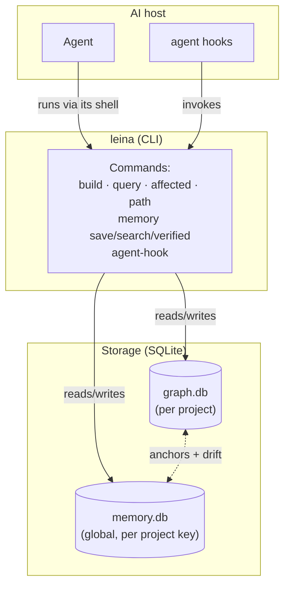

# How leina works — conceptual guide

> These documents explain **how leina works under the hood**: the mechanics of
> the graph, the memory, search, and the hooks. If what you're looking for is *how to install
> and use it*, those how-tos already live in [`GETTING_STARTED.md`](../GETTING_STARTED.md),
> [`CLI_REFERENCE.md`](../CLI_REFERENCE.md), and [`usage-guide.md`](../guides/usage-guide.md).

The prose is in English; code names, commands, and technical terms (`node`, `edge`,
`drift`, `anchor`, `hook`) are kept as they appear in the code and the CLI.

> 🌐 **Prefer reading it in the browser, with diagrams already rendered?** The project's
> bilingual (EN/ES) documentation site — not just this conceptual guide — is generated
> with:
>
> ```bash
> npm run docs:site:build      # generates site/index.html (all pages, EN + ES)
> open site/index.html          # (macOS; on Linux use xdg-open)
> ```
>
> It's a single self-contained HTML file with a navigation bar, language switcher, and
> rendered Mermaid diagrams. It's regenerated from these same `.md` files (plus their
> translations in `docs/i18n/`), so the source of truth remains the markdown. It requires a
> connection the first time (it loads `marked` and `mermaid` from a CDN). The site is also
> published automatically to GitHub Pages on every push to `main`.

---

## The analogy used throughout this guide

Imagine that every repository has **two invisible employees** working for your AI:

- **The cartographer** (the **graph**) draws up a *map* of the code: what piece calls what,
  what inherits from what, what breaks if you touch something. It knows **what** the code IS.
- **The librarian with their logbook** (the **memory**) writes down *why* things are
  the way they are: decisions, resolved bugs, conventions. It knows **why** the code came to
  be this way.

The two talk to each other: when the librarian writes a note about "the `TokenFactory`
class," they stick a **sticky note (`anchor`)** on that page of the map. If the cartographer
redraws that page, the librarian learns that their note **may have gone stale** (that's
*drift*). And a **concierge (the `hooks`)** leaves notes on your desk at the start and end of
each session — without ever locking the door on you.

That metaphor — cartographer, librarian, sticky notes, and concierge — comes back in every
document.

---

## Documentation map

Read them in this order if you're starting from scratch:

| # | Document | What it covers | Employee |
|---|-----------|--------------|----------|
| 1 | [General architecture](./01-arquitectura.md) | The layers (domain / application / infrastructure / cli), why it's CLI-first, pure writers | (the whole company) |
| 2 | [The code graph](./02-grafo.md) | How code is extracted into a graph, what a `node` and an `edge` are, resolution and dedup | the cartographer |
| 3 | [Search and queries](./03-busqueda-y-consultas.md) | `query`, `affected`, `path`, and the *freshness gate* (auto-rebuild vs refuse) | the cartographer |
| 4 | [Project memory](./04-memoria.md) | `observations`, `sessions`, the *project key*, FTS5/BM25 search | the librarian |
| 5 | [How the graph and memory talk to each other](./05-comunicacion-grafo-memoria.md) | `anchors` and *drift detection* (USABLE / WARNING / DO-NOT-USE) | the sticky notes |
| 6 | [Hooks and context injection](./06-hooks-e-inyeccion.md) | Agent hooks lifecycle, markers, active injection | the concierge |

---

## Bird's-eye view



Three ideas worth remembering right away:

1. **CLI-first.** The everyday surface is short commands that run, respond, and exit —
   nothing runs in the background by default. When you want a server, you ask for one
   explicitly: `leina mcp` is the MCP server (over stdio) your AI host launches to call
   leina's tools, and `leina graph serve` is an optional read-only HTTP explorer bound to
   loopback that you run on demand and stop with Ctrl+C.
2. **Two separate SQLite databases.** The graph lives in `<project>/.leina/graph.db`
   (one per repo, git-ignored). The memory lives in `~/.leina/memory.db` (a single,
   global one, segmented by *project key*). They are **decoupled on disk** and only meet in
   the application layer, via `anchors`.
3. **Everything is advisory.** The hooks never block the agent. In the worst case they leave
   a note on `stderr`; the agent always keeps going. *Fail-open* on every error.
