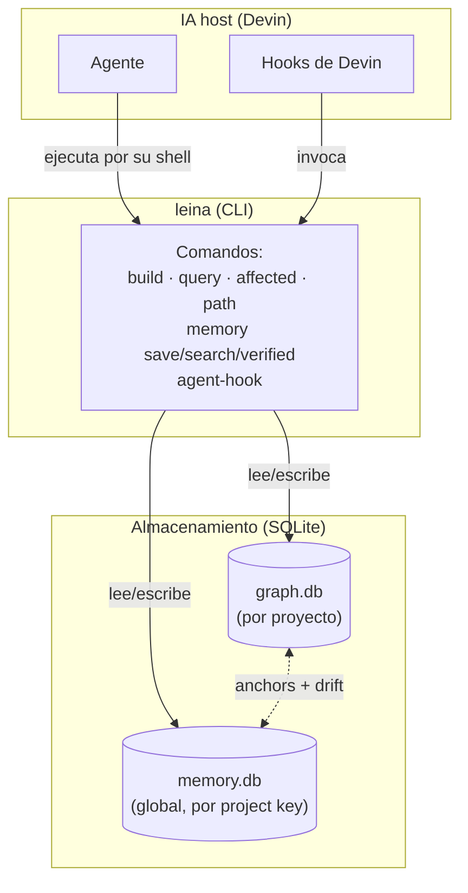

# Cómo funciona leina — guía conceptual

> Estos documentos explican **cómo funciona leina por dentro**: la mecánica del
> grafo, la memoria, la búsqueda y los hooks. Si lo que buscás es *cómo instalarlo y usarlo*,
> esos how-to ya viven en [`GETTING_STARTED.md`](../GETTING_STARTED.md),
> [`CLI_REFERENCE.md`](../CLI_REFERENCE.md) y [`usage-guide.md`](../guides/usage-guide.md).

La prosa está en español; los nombres de código, comandos y términos técnicos (`node`, `edge`,
`drift`, `anchor`, `hook`) se mantienen en inglés porque así aparecen en el código y en la CLI.

> 🌐 **¿Preferís leerlo en el navegador, con los diagramas ya renderizados?** El sitio de
> documentación bilingüe (EN/ES) de todo el proyecto — no solo esta guía conceptual — se genera
> con:
>
> ```bash
> npm run docs:site:build      # genera site/index.html (todas las páginas, EN + ES)
> open site/index.html          # (macOS; en Linux usá xdg-open)
> ```
>
> Es un único archivo HTML autocontenido con barra de navegación, selector de idioma y los
> diagramas Mermaid dibujados. Se regenera a partir de estos mismos `.md` (más sus traducciones
> en `docs/i18n/`), así que la fuente de verdad sigue siendo el markdown. Requiere conexión la
> primera vez (carga `marked` y `mermaid` desde un CDN). El sitio también se publica
> automáticamente en GitHub Pages en cada push a `main`.

---

## La analogía que usamos en toda la guía

Imaginá que cada repositorio tiene **dos empleados invisibles** trabajando para tu IA:

- **El cartógrafo** (el **grafo**) levanta un *mapa* del código: qué pieza llama a cuál,
  qué hereda de qué, qué se rompe si tocás algo. Sabe **qué ES** el código.
- **El bibliotecario con su diario de bitácora** (la **memoria**) anota *por qué* las cosas
  son como son: decisiones, bugs resueltos, convenciones. Sabe **por qué** el código llegó a
  ser así.

Los dos hablan entre sí: cuando el bibliotecario anota algo sobre "la clase `TokenFactory`",
le pone un **post-it (`anchor`)** sobre esa página del mapa. Si el cartógrafo redibuja esa
página, el bibliotecario se entera de que su nota **puede haber quedado vieja** (eso es el
*drift*). Y un **conserje (los `hooks`)** deja notas en tu escritorio al empezar y al terminar
cada sesión — sin trabarte nunca la puerta.

Esa metáfora — cartógrafo, bibliotecario, post-its y conserje — vuelve en cada documento.

---

## Mapa de la documentación

Leelos en este orden si venís de cero:

| # | Documento | De qué trata | Empleado |
|---|-----------|--------------|----------|
| 1 | [Arquitectura general](./01-arquitectura.md) | Las capas (domain / application / infrastructure / cli), por qué es CLI-first, writers puros | (la empresa entera) |
| 2 | [El grafo de código](./02-grafo.md) | Cómo se extrae el código a un grafo, qué es un `node` y un `edge`, resolución y dedup | el cartógrafo |
| 3 | [Búsqueda y consultas](./03-busqueda-y-consultas.md) | `query`, `affected`, `path` y el *freshness gate* (auto-rebuild vs refuse) | el cartógrafo |
| 4 | [La memoria de proyecto](./04-memoria.md) | `observations`, `sessions`, el *project key*, búsqueda FTS5/BM25 | el bibliotecario |
| 5 | [Cómo se hablan grafo y memoria](./05-comunicacion-grafo-memoria.md) | `anchors` y *drift detection* (USABLE / WARNING / DO-NOT-USE) | los post-its |
| 6 | [Hooks e inyección de contexto](./06-hooks-e-inyeccion.md) | Ciclo de vida de los hooks de Devin, markers, inyección activa | el conserje |

---

## Vista de pájaro



Tres ideas que conviene grabarse desde ya:

1. **CLI-first.** La superficie de todos los días son comandos cortos que corren, responden
   y terminan — nada corre en segundo plano por default. Cuando querés un servidor, lo pedís
   explícitamente: `leina mcp` es el servidor MCP (por stdio) que tu host de IA lanza para
   llamar a las herramientas de leina, y `leina graph serve` es un explorador HTTP de solo
   lectura en foreground, ligado a loopback, que corés cuando lo necesitás y frenás con Ctrl+C.
2. **Dos bases SQLite separadas.** El grafo vive en `<proyecto>/.leina/graph.db`
   (uno por repo, git-ignored). La memoria vive en `~/.leina/memory.db` (una sola,
   global, segmentada por *project key*). Están **desacopladas en disco** y solo se unen en la
   capa de aplicación, vía `anchors`.
3. **Todo es advisory.** Los hooks nunca bloquean al agente. En el peor caso dejan una nota en
   `stderr`; el agente siempre sigue. *Fail-open* en cada error.
