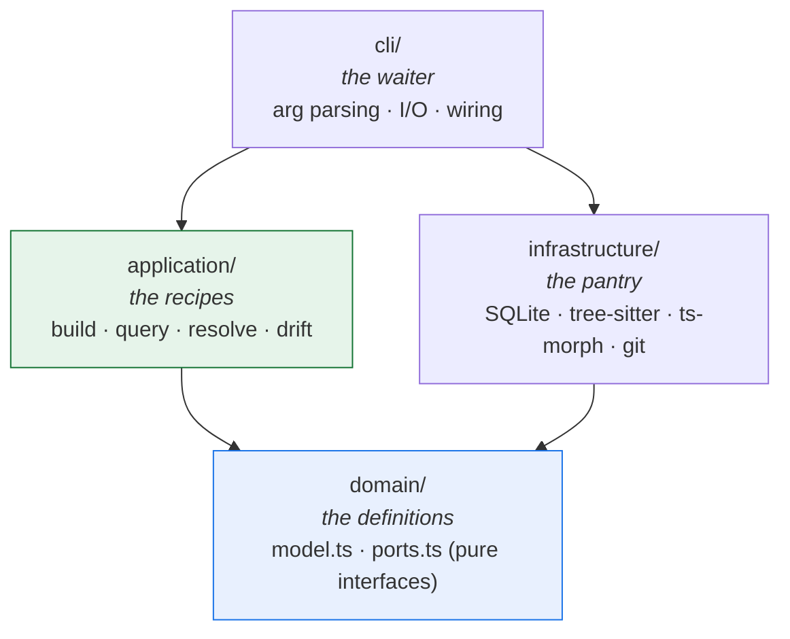
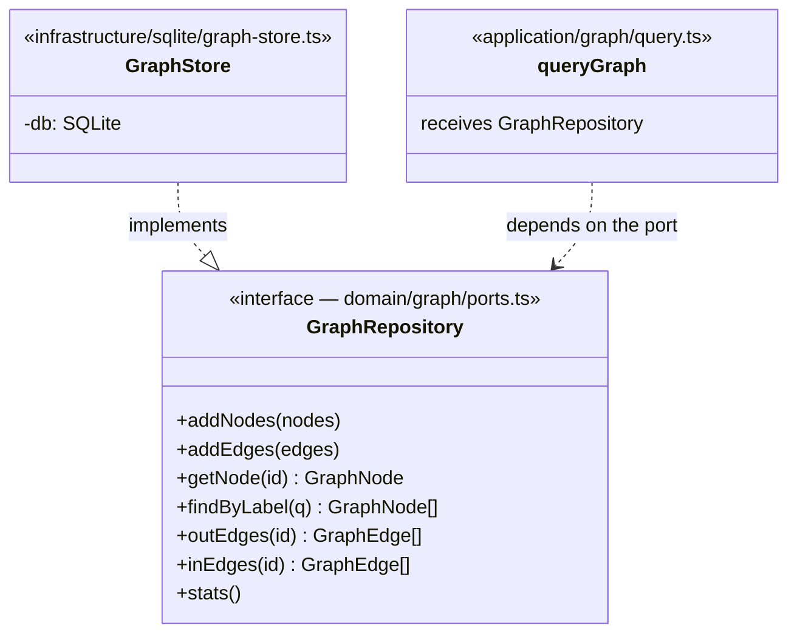
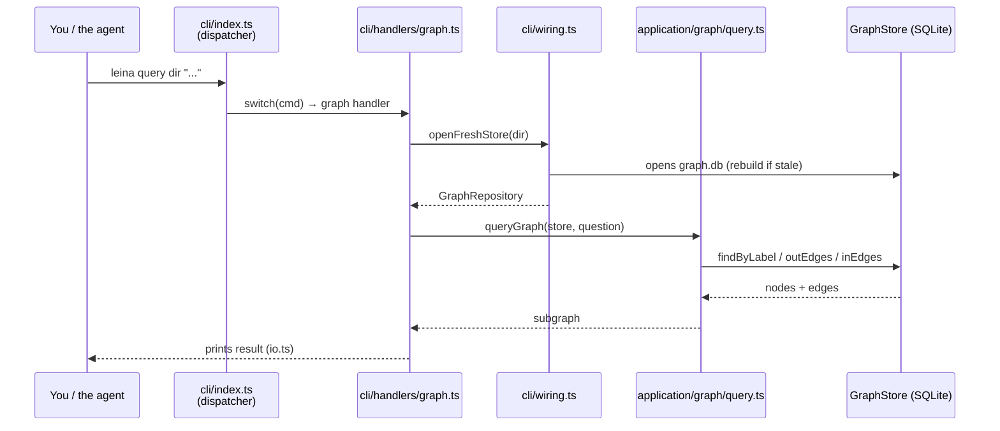
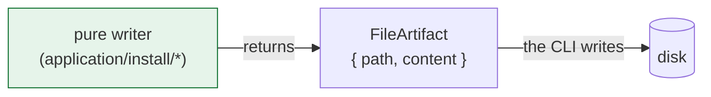

# 1. General architecture

> **In one sentence:** leina is a CLI with a **hexagonal** architecture (ports and
> adapters) in four layers, where the business logic knows nothing about SQLite or the
> file system — and where *there is no server*.

---

## The restaurant kitchen

Think of leina as a restaurant:

- The **waiter** (`cli/`) takes your order (`leina query ...`), carries it to the
  kitchen, and brings you the dish. It doesn't cook; it only translates between you and
  the kitchen.
- The **recipes** (`application/`) describe *how* to prepare each dish step by step, no
  matter what brand of oven or fridge you have.
- The **pantry and appliances** (`infrastructure/`) are the concrete things: the fridge
  (SQLite), the oven (tree-sitter, ts-morph), the scale (git).
- The **definitions of what each dish is** (`domain/`) — what goes into a "pizza," what a
  "node" or an "edge" is — are pure contracts: no appliances, no brands.

The golden rule of the kitchen: **the recipes and the definitions never mention brands**.
If you swap the fridge tomorrow, the recipes don't change. That's the **dependency rule**
of hexagonal architecture.

---

## The four layers

The arrows are **allowed dependencies**. Notice that they all point toward `domain/`, and
that `application/` **never** points to `infrastructure/`: the recipes don't know about
brands.

| Layer | Folder | Responsibility | Examples |
|------|---------|-----------------|----------|
| **Domain** | `src/domain/` | Pure types and contracts. Zero I/O, zero external dependencies. | `graph/model.ts` (`GraphNode`, `GraphEdge`), `graph/ports.ts` (`GraphRepository`), `memory/model.ts`, `memory/ports.ts` |
| **Application** | `src/application/` | Use cases / algorithms. Depends only on `domain`. | `graph/build.ts`, `graph/query.ts`, `graph/resolve.ts`, `memory/query.ts` (drift), `project/detect-key.ts` |
| **Infrastructure** | `src/infrastructure/` | Concrete adapters that *implement* the ports. | `sqlite/graph-store.ts`, `sqlite/memory-repository.ts`, `extractors/treesitter.ts`, `extractors/semantic/tsmorph.ts` |
| **CLI** | `src/cli/` | Composition + I/O. The only place that *builds* infrastructure. | `index.ts` (dispatcher), `wiring.ts` (composition root), `handlers/*`, `io.ts` |

---

## Ports and adapters, concretely

The contract lives in `domain`; the implementation, in `infrastructure`. The
`application` layer receives the contract and never knows who fulfills it.

The **composition root** is <ref_file file="src/cli/wiring.ts" />: it's the *only* place
where `new GraphStore(...)` or `new SQLiteMemoryRepository(...)` is called. Handlers
receive the port, never the concrete class. <ref_snippet file="src/cli/wiring.ts" lines="26-30" />

---

## The journey of a command

When you run `leina query <dir> "who uses TokenFactory"`, here's what happens:

`index.ts` is a **pure dispatcher**: a `switch (cmd)` over `process.argv` that routes to
the correct handler. All the logic lives further in.

---

## Two design decisions worth understanding

### CLI-only (there is no server)

Every capability is a `leina <subcommand>` that starts up, responds, and dies. Why?

- **Fast startup (~0.15s) on the read path.** The heavy extraction stack (tree-sitter +
  ts-morph) is loaded with a *dynamic* `import()`, only in `build`/`refresh`. A `query` or
  a `memory search` never pays that cost. That's why `wiring.ts` notes that the
  extractor's `import()` "stays in the command handlers".
- **No state between invocations.** There's no daemon that can drift out of sync; every
  command reads fresh state from disk.

### Pure writers (`FileArtifact`)

Everything that *writes files* on the install surface (skills, agents, hooks, protocol)
is modeled as **pure functions** that return `FileArtifact { path, content }` — defined in
`src/domain/install/artifact.ts`. The writer **never touches disk**; the CLI does all the
I/O.

Two practical consequences:

1. **Idempotence.** Re-running a writer over its own output returns exactly the same
   thing.
2. **Testable without a filesystem.** You test the `content` it produces without mounting
   directories.

---

## Up next

- How the cartographer builds the map → [The code graph](./02-grafo.md)
- How that map is queried → [Search and queries](./03-busqueda-y-consultas.md)
