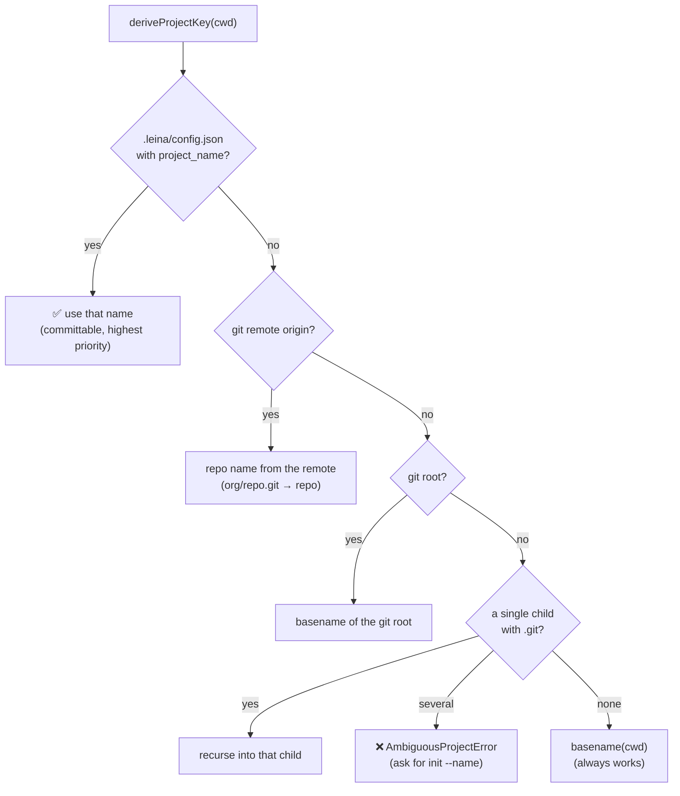
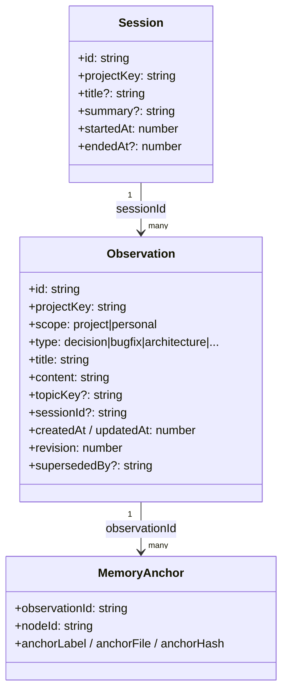
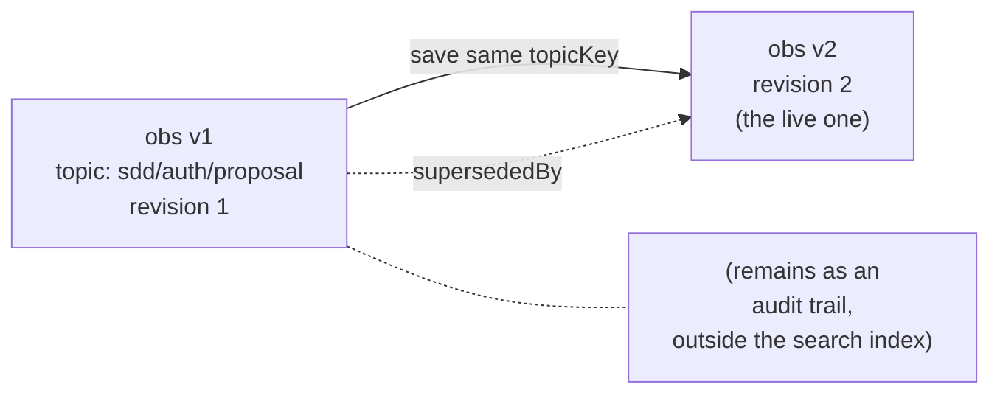
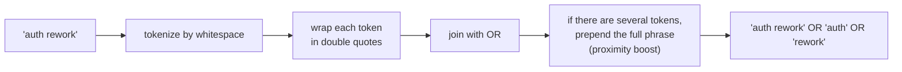

# 4. Project memory

> **In one sentence:** memory is the project's *logbook* — it records decisions, resolved
> bugs, and conventions so the AI doesn't have to rediscover them every session — and it
> lives in **a single global database** segmented by project.

The graph knows *what* the code IS. Memory knows *why* it ended up that way. It's the
difference between reading a building's blueprint and reading the architect's notes on why
they moved that column.

---

## Where it lives and how it's segmented

Unlike the graph (one `graph.db` per repo), **all** memory lives in a single global
database: `~/.leina/memory.db`. There's no need to initialize the project; memory is
always-on.

So how do projects avoid getting mixed together? Through the **project key**: a stable
label that segments each observation. It's like a shared diary where each project has its
own tab.

### Deriving the project key

`deriveProjectKey` (<ref_file file="src/application/project/detect-key.ts" />) works its way down a **fail-open cascade**: it uses the
first source that works.

The result is normalized (`normalizeProjectKey`): NFKC, lowercase, path separators → `-`,
collapsing non-alphanumerics into a single `-`. **Important:** project keys use
**hyphens**, not underscores (unlike the graph's node IDs, which use `_`). That keeps the
two namespaces separate.

If the `cwd` is not a git repo and there are **several** child repos, an
`AmbiguousProjectError` is thrown: you need to fix the name with `leina init --name <name>`
(which writes the committable `config.json`).

---

## The model: observations and sessions

Defined in <ref_file file="src/domain/memory/model.ts" />.

### The `observation` (a diary entry)

It's a dated, **typed** fact about the project. The `type` classifies its nature:

| `type` | What it's for |
|--------|----------|
| `decision` | a design decision and its reasoning |
| `bugfix` | a bug and how it was fixed |
| `architecture` | a structural description |
| `discovery` | a non-obvious finding |
| `pattern` | a recurring pattern in the code |
| `config` | something about configuration |
| `preference` | a team/user preference |
| `manual` | a free-form note |

This `type` distinction reappears in [drift detection](./05-comunicacion-grafo-memoria.md):
some types are *descriptive* (they expire when the code changes) and others *normative*
(rules that keep holding even as the code moves).

### The `topicKey` and upsert (evolving an entry in place)

If you save an observation with a `topicKey` (a stable slug like
`sdd/auth-rework/proposal`) and later save another one with the **same** `topicKey`, the old
one is **not** deleted: it's marked `supersededBy` (it remains as an audit trail) and the
new one takes its place with an incremented `revision`. It's a diary where you can *edit a
page* without losing the earlier versions.

### The `session` (a work shift)

Groups observations from a single work session (`startedAt`/`endedAt`). At the end of a
session, `leina memory session <dir> --content "..."` saves a summary.

---

## How it's stored (the `memory.db`)

`SQLiteMemoryRepository` (<ref_file file="src/infrastructure/sqlite/memory-repository.ts" />) implements the
`MemoryRepository` port. The schema lives in <ref_file file="src/infrastructure/sqlite/schema.ts" /> (version 4) and has
four pieces:

| Table | What it stores |
|-------|-----------|
| `sessions` | sessions (indexed by `project_key, started_at DESC` for recency) |
| `observations` | the diary entries; `topic_key` with a **partial** unique index (only live rows, `superseded_by IS NULL`) |
| `obs_fts` | virtual **FTS5** table for full-text search |
| `memory_anchors` | the sticky notes that link an observation to graph nodes (see [chapter 5](./05-comunicacion-grafo-memoria.md)) |

### FTS5: full-text search

`obs_fts` is a virtual FTS5 table in *external-content* mode that indexes `title` and
`content`. Two tokenizer details matter:

- **porter** (English stemming): "running" matches "run".
- **unicode61 + remove_diacritics**: accent-insensitive search — key for writing the diary
  in Spanish ("migración" matches "migracion").

**Saved triggers:** only **live** observations (`superseded_by IS NULL`) enter the index.
Superseded versions remain in the base table (for audit) but **never score** in searches.
There are three triggers (`obs_ai`, `obs_au`, `obs_ad`) that guard INSERT/UPDATE/DELETE to
maintain that invariant.

---

## How it's searched (BM25)

`searchMemory` (<ref_file file="src/application/memory/query.ts" />) delegates to the repository, which runs an FTS5
query ranked by **BM25**. What's interesting is how the query is **sanitized** before being
sent to FTS5:

The strategy is **recall-first**: joining with `OR` makes it match any term, and BM25 sorts
the best hits first. The full phrase as an extra term gives a boost to documents where the
words appear together. Each `SearchHit` carries `id`, `title`, `type`, `topicKey`, a
`snippet` (first ~200 chars), the BM25 score, and `updatedAt`.

Read commands:

- `leina memory search <dir> "<query>"` — raw search (the above).
- `leina memory context <dir>` — recent sessions + latest observations.
- `leina memory verified <dir> "<query>"` — search **+ drift check** against the graph.
  That's exactly the subject of the next chapter.

---

## Up next

- How the librarian knows a note has gone stale → [Graph–memory communication](./05-comunicacion-grafo-memoria.md)
- How this diary gets injected into the agent without it having to ask → [Hooks and injection](./06-hooks-e-inyeccion.md)
